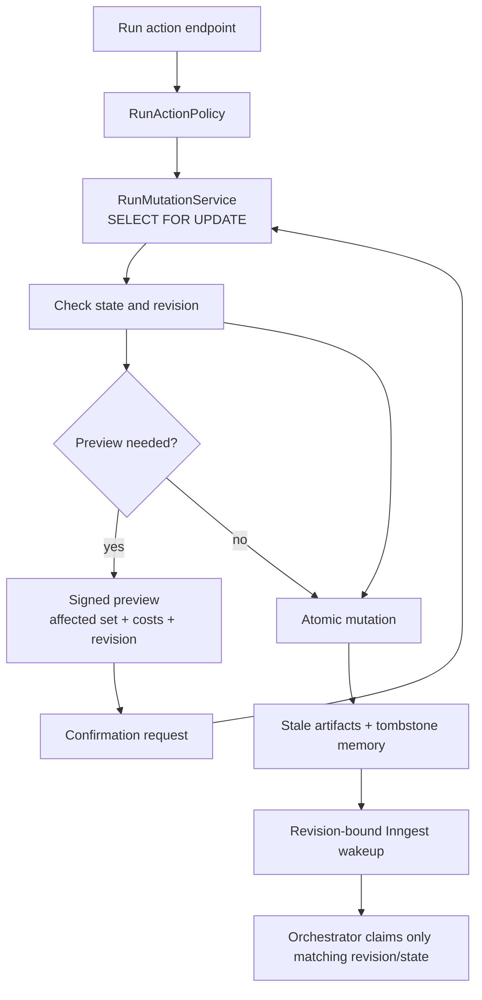
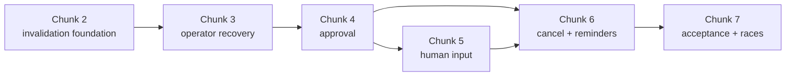

# Phase 4 — Inputs and Human-in-the-Loop, Chunks 2–7

Status: implementation plan  
Baseline: `main` at `007718d` (Phase 4 chunk 1)  
Scope: remaining Phase 4 work only; no production code is changed by this plan

## Outcome

Finish the run-control layer around the execution engine: precise invalidation,
recoverable operator actions, approval and routed rejection, `human.input`,
cancellation, reminders, and the complete §12.4 action matrix.

At the end of Chunk 7, every mutation that can make prior outputs inconsistent
will be previewed when necessary, serialized by the run row, auditable, and safe
against delayed Inngest events.

## Locked product decisions

These decisions were made before implementation and are not reopened here:

1. Run creation and run start remain separate operations so media inputs can be
   attached during the meaningful `CREATED` window.
2. Generic `POST /runs/:id/resume` supports only `PAUSED_BUDGET` and `FAILED`.
   Approval and input pauses resume through their dedicated endpoints.
3. `human.input` submissions run normal checks; declaring QC on a
   `human.input` stage is a blueprint validation error.
4. Approval and input waits park indefinitely. They do not auto-approve,
   auto-reject, auto-submit, fail, or cancel.
5. An hourly reminder sweep records/emits reminders at 24 and 48 hours.
   External notification delivery is deliberately deferred.
6. Chunk 1's create/start split, run-input artifacts, channel assets, and
   snapshotted `{from:'asset'}` bindings remain the foundation.

## Current baseline and gaps

Already implemented:

- run inputs as `$input:<key>` artifacts;
- channel assets and immutable run-time asset snapshots;
- append-only Run Memory value writes;
- semantic attempts, checks, QC, budget reservation/settlement, and
  `PAUSED_BUDGET`;
- sequential Inngest orchestration and resumable budget pauses.

Gaps that must be closed before user actions are safe:

- Script-check reference provenance is resolved but discarded. Only slot and
  context provenance currently reaches `stage_attempt.resolved_inputs`.
- Run Memory has no tombstone writer. Its current query filters tombstones out
  before ordering, which would resurrect an older value after invalidation.
- Artifact activation, attempt state, execution state, and memory writes do not
  yet share a sufficiently broad transaction for approval/edit flows.
- `stage.execute` uses authored `stage.retryLimit` instead of the effective
  override-aware `effective.retryLimit`.
- `FAILED -> RUNNING` does not clear `run.ended_at`.
- A delayed `run/resumed` event can currently mark a newer `CANCELLED` run as
  `RUNNING` because events have no run revision precondition.
- Provider cancellation returns no confirmation, so the ledger cannot choose
  correctly between release and provisional actual settlement.
- The web shell still creates a run without calling the separate start endpoint;
  UI completion remains secondary to the Phase 4 backend acceptance path.

## Cross-cutting architecture



### 1. Run revision and mutation serialization

Add `run.revision bigint not null default 0`. Introduce
`RunMutationService.withLockedRun(runId, action, allowedStates, callback)`:

- starts a database transaction;
- locks the run row with `SELECT ... FOR UPDATE`;
- rechecks the current state through `RunActionPolicy`;
- performs all state/artifact/memory changes using the supplied transaction;
- increments the revision exactly once for a successful logical mutation;
- returns the committed revision for any follow-up event.

Do not hold the transaction open while calling a provider, storage service, or
Inngest. Persist intent first, commit, then perform the external action using an
idempotent identifier.

`LedgerService` keeps its existing run-row locking. Shared helpers must accept a
transaction handle so nested operations do not open competing transactions.

Add a durable `run_wakeup` outbox table so a committed mutation cannot leave a
run parked merely because the immediate `inngest.send()` failed:

- `id`/`wakeup_id` (unique and used as the Inngest event ID);
- `run_id`, `action`, and `source_state`;
- `expected_revision` and event name;
- `created_at`, `dispatched_at`, `claimed_at`;
- dispatch attempt count and last error.

The same transaction that increments `run.revision` inserts its wakeup row.
After commit, the endpoint asks `RunWakeupDispatcher` to deliver it. A periodic
dispatcher retries undispatched rows, and endpoint replay may safely request
delivery of the same wakeup. Inngest deduplicates by `wakeupId`; the orchestrator
claim is also idempotent in the database. This is a transactional outbox for
control events, not a general messaging subsystem.

### 2. Revision-bound orchestration events

All start/resume/action wakeups carry:

```ts
type RunWakeup = {
  runId: string;
  expectedRevision: number;
  wakeupId: string;
  action: string;
  sourceState: RunState;
};
```

The first orchestration step atomically claims the wakeup only when the run's
revision, action, and source state still match the persisted outbox row. A stale
or duplicate wakeup returns `{ ignored: true }`; it never changes state.
Successful claim stamps `claimedAt`. `RUNNING` clears `endedAt`; terminal
transitions set it.

`run/started` may claim only `CREATED`. Action-specific wakeups may claim only
the source states allowed for that action. `CANCELLED` is never resumable.

### 3. Signed invalidation previews

Use stateless HMAC-SHA256 preview tokens built with Node `crypto`; do not add a
preview table or dependency.

Configuration:

- `PREVIEW_TOKEN_SECRET` — required outside tests;
- `PREVIEW_TOKEN_TTL_SEC` — default `600`.

The signed payload contains:

- version and action kind;
- run ID and run revision;
- target stage/item/input;
- digest of any proposed replacement, edit, override, or rejection payload;
- affected execution and active artifact IDs;
- stable closure fingerprint;
- per-artifact spent/estimated rerun costs and totals;
- issued-at and expires-at timestamps.

Confirmation must still lock the run, verify signature/expiry/action/payload
digest/revision, recompute the closure, and compare its fingerprint. IDs inside
the token are never trusted without recomputation. A successful confirmation
increments `run.revision`, making replay of the same token invalid.

### 4. Action policy

One `RunActionPolicy` owns §12.4. Disallowed operations throw Nest
`ConflictException` with `{ state, action, allowedStates }`.

| Action                   | CREATED | RUNNING | PAUSED_*      | FAILED | COMPLETED | CANCELLED |
| ------------------------ | ------- | ------- | ------------- | ------ | --------- | --------- |
| Attach/start             | yes     | no      | no            | no     | no        | no        |
| Raise budget             | no      | yes     | yes           | yes    | no        | no        |
| Retry/edit/replace input | no      | no      | yes           | yes    | yes       | no        |
| Patch overrides          | no      | no      | yes           | yes    | no        | no        |
| Approve/reject           | no      | no      | approval only | no     | no        | no        |
| Submit human input       | no      | no      | input only    | no     | no        | no        |
| Generic resume           | no      | no      | budget only   | yes    | no        | no        |
| Cancel                   | yes     | yes     | yes           | yes    | no        | no        |

Item-aware request shapes may land now, but Phase 4 must not claim to implement
iteration or partial item resume. Runtime item actions remain guarded until
Phase 7.

### 5. Observational invalidation

Invalidation uses what active successful attempts actually read, not a declared
dependency graph.

Normalize provenance keys as:

- `slots.<name>`;
- `context.<name>`;
- `checks.<checkIndex>.refs.<name>`.

Each entry retains its `Ref` and one of `artifactId`, `inputKey`, `assetId`, or
`memoryKey + memoryVersion`.

To compute a closure:

1. Seed the target stage/item/input artifact.
2. Walk later stages in blueprint array order until stable.
3. Add an active execution if its active attempt read an invalid artifact, the
   replaced input key, or a memory version written by an invalid writer.
4. Preserve unrelated later stages even when they are adjacent in the graph.
5. For routed rejection, always include the gated stage as well as the retry
   target; the user explicitly rejected that gated artifact.

Phase 4 implements stage-level execution. Keep item fields in internal types so
Phase 7 can add `prevItem` and aligned-item rules without replacing the engine.

### 6. Invalidation transaction

After preview verification and while holding the run lock:

1. mark affected active artifacts stale;
2. mark affected executions stale and clear active output pointers where
   appropriate;
3. append tombstones for memory keys whose current value was written by an
   invalidated stage/item;
4. mark only run-scoped media blobs `gcEligible=true` and
   `gcEligibleAt=now()` in the same update;
5. increment the target generation for UI history;
6. clear affected failures/timestamps needed for rerun;
7. set the cursor to the earliest invalidated stage in graph order;
8. increment the run revision.

Nothing is hard-deleted. Input, character, and channel-asset blobs are never
made retention-eligible by run invalidation.

### 7. Cost preview

- `spentUsd`: immutable cost recorded on each affected active artifact.
- `estimatedRerunUsd`: the last reservation ceiling associated with that
  artifact's attempt. This is conservative, reproducible, and does not require
  executing the capability during preview.
- Human/manual-only work estimates to zero.
- Responses include per-artifact rows and totals, explicitly labelled as
  estimates rather than quotes.

## Chunk 2 — Invalidation engine, previews, and tombstones

### Goal

Land one tested dependency/invalidation engine that every later action reuses.
Do not expose retry, edit, approval, or human-input mutations until this layer is
correct.

### Implementation

1. Add the run revision migration and supporting indexes:
   - new `run_wakeup` outbox table and undispatched index;
   - `stage_attempt(artifact_id)`;
   - `stage_attempt(stage_execution_id)` if the existing index is insufficient;
   - `run_memory(run_id, written_by, written_item)`.
2. Add `RunMutationService`, `RunActionPolicy`, and `PreviewTokenService`.
   Add `RunWakeupDispatcher` and a retrying `run.wakeup-dispatch` function.
3. Merge check-ref provenance into the existing attempt provenance before the
   attempt can become active.
4. Correct Run Memory current-value semantics:
   - fetch the highest version first;
   - if that row is a tombstone, the key is absent;
   - never use `WHERE tombstone=false ORDER BY version`, which resurrects an
     older value.
5. Add tx-aware `MemoryService.listCurrent()` and
   `appendTombstones(tx, invalidatedWriters)`.
6. Keep `max(version)+1` safe through the per-run row lock; add unique-conflict
   retry as defense against accidental callers outside that boundary.
7. Add `InvalidationService` with pure closure/fingerprint logic separated from
   DB loading and atomic application.
8. Make `ArtifactService` operations transaction-aware so a caller can own the
   complete stale/activate/repoint/memory/state transaction.
9. Add `GET /runs/:id/memory`, returning current values plus append-only history.
10. Add read-only
    `GET /runs/:id/invalidation-preview?stageKey=&itemIndex=`.
11. Add revision-bound event contracts and claim logic, but retain existing
    budget resume behavior until Chunk 3 switches it over.

### Primary files

- `apps/api/src/db/schema/run.ts`
- `apps/api/src/db/schema/execution.ts`
- `apps/api/src/db/schema/memory.ts`
- new `apps/api/src/db/schema/run-wakeup.ts`
- new Drizzle migration and metadata
- `apps/api/src/artifact/artifact.service.ts`
- `apps/api/src/artifact/memory.service.ts`
- `apps/api/src/artifact/binding-resolver.service.ts`
- `apps/api/src/orchestration/stage-runner.service.ts`
- `apps/api/src/orchestration/run-state.service.ts`
- `apps/api/src/orchestration/functions/run-orchestrate.fn.ts`
- new `apps/api/src/run/invalidation.service.ts`
- new `apps/api/src/run/preview-token.service.ts`
- new `apps/api/src/run/run-mutation.service.ts`
- new `apps/api/src/run/run-action-policy.ts`
- new `apps/api/src/run/run-wakeup-dispatcher.service.ts`
- new `apps/api/src/orchestration/functions/run-wakeup-dispatch.fn.ts`
- `apps/api/src/orchestration/functions/index.ts`
- `apps/api/src/run/run.controller.ts`
- `apps/api/src/run/run.module.ts`
- `apps/api/src/config/env.schema.ts`
- `apps/api/src/config/engine-config.ts`
- `.env.example`

### Tests and exit criteria

- Unit closure tests: direct `prev`, check ref, memory version, input key, and
  unrelated later stage survival.
- Latest tombstone makes a key absent; an older value is never resurrected.
- Token tampering, expiry, payload mismatch, revision mismatch, and closure
  mismatch are rejected.
- A committed action whose first Inngest send fails is delivered by the outbox
  dispatcher exactly once from the engine's perspective.
- Stale marking, memory tombstones, and `gcEligibleAt` commit atomically.
- A delayed wakeup carrying an old revision is ignored.
- Existing Phase 1–3 unit/E2E suites remain green.

## Chunk 3 — Retry/confirm, overrides, generalized resume, and manual edit

### Goal

Turn the Chunk 2 machinery into the operator recovery flows, while preserving
immutable blueprint versions and audit history.

### Stage retry

- `POST /runs/:id/stages/:key/retry` returns a signed preview.
- `POST /runs/:id/stages/:key/retry/confirm` applies the exact recomputed
  invalidation set and emits a revision-bound wakeup.
- Attempt numbers remain monotonic and are never reset. Generation is UI
  history only.
- Keep item routes/DTOs forward-compatible, but reject item execution until
  Phase 7 supplies iteration semantics.

### Run-input replacement

Extend `PUT /runs/:id/inputs/:key`:

- in `CREATED`, retain Chunk 1's immediate attachment behavior;
- in paused/failed/completed states, first validate the proposed replacement
  and return a preview;
- confirmation includes the same payload plus the token;
- bind the token to a canonical payload digest;
- stale the old `$input:<key>` artifacts, insert replacements active, update
  `run.inputs` for text/data, invalidate true dependents, and wake from the
  earliest affected stage;
- call `storage.stat()` again before confirming uploaded media.

Abandoned untracked upload objects remain a storage-cleanup concern and do not
justify widening this chunk into blob GC.

### Overrides

Add `PATCH /runs/:id/overrides` with a sparse per-stage `ConfigLayer` map:

- validate stage keys and every layer;
- output schema is not representable in `ConfigLayer` and remains immutable;
- use preview/confirm when a changed stage already has an active artifact;
- when the cursor is failed/budget-blocked and has no passing output, apply the
  patch directly but leave the run parked for explicit generic resume;
- completed runs cannot be overridden.

Fix `stage.execute` to use `effective.retryLimit`.

### Generic resume

- Accept only `PAUSED_BUDGET` and `FAILED`.
- Confirm the cursor execution is actually resumable.
- Keep the run parked until the revision-bound wakeup is claimed.
- Clear `endedAt` only when the orchestrator successfully claims the wakeup.
- `PAUSED_APPROVAL` and `PAUSED_INPUT` return `409`.

### Manual artifact edit

`POST /runs/:id/stages/:key/artifact` is preview/confirm and bound to the
replacement payload.

On confirmation, in one transaction:

1. select and bind the source artifact explicitly: the active artifact for a
   passed/completed execution, or the most recent stale candidate from the
   cursor attempt when the execution is failed/awaiting approval;
2. validate kind/data against the stage output schema;
3. tombstone old memory writes and invalidate downstream dependents;
4. stale the predecessor, when active, before inserting the replacement;
5. insert an active `userAuthored=true` artifact;
6. insert a user attempt with `outcome='user_edit'`, `actor='user'`, and the
   previous artifact ID in audit inputs;
7. repoint output, increment attempt count, mark the edited execution `passed`,
   and apply new memory writes;
8. if the source was an awaiting-approval candidate, resolve its open wait—the
   edit satisfies the gate;
9. skip checks and QC—the user outranks the judge;
10. exclude the edited target from rerun and wake the earliest invalidated
    downstream stage, or remain completed if no work is invalidated.

Text/data edits are required in Phase 4. Media-edit upload/probe behavior waits
for Phase 5.

### Additional API/read models

- `GET /runs/:id/stages/:key/attempts` surfaces actor, pending artifact,
  review note, check results, QC verdict, and cost.
- DTOs return structured conflict and preview information rather than relying
  on raw error strings.

### Tests and exit criteria

- Stage retry invalidates only observed dependents.
- Same confirmation twice cannot apply twice.
- Input replacement invalidates only readers of that input.
- `FAILED -> override -> resume` preserves attempts and old artifacts.
- Stage-cap override can unblock a budget pause.
- Approval/input generic resume returns `409`.
- Manual edit obeys stale-before-insert, validates schema, skips checks/QC,
  rewrites memory correctly, and keeps audit history.
- A competing mutation makes every older preview token stale.

## Chunk 4 — Stage approval and routed rejection

### Goal

Gate a passing candidate before activation, and make rejection feedback reach a
stage capable of changing the result.

### Data model

Add:

- `stage_attempt.critique_target_stage_key nullable`, indexed with outcome;
- `human_wait`:
  - `id`, `run_id`, `stage_execution_id`, nullable `stage_item_id`;
  - `kind` (`approval | input`);
  - `waiting_since`;
  - `reminded_24h_at`, `reminded_48h_at`;
  - `resolved_at`;
  - partial unique index allowing one open wait per execution/item.

The wait table is introduced here so approval and input use the same durable
attention model and Chunk 6 can add reminders without schema churn.

### Execution behavior

After provider fetch, checks, and optional QC pass:

- if no approval is declared, keep the existing finalization path;
- if approval is declared, leave the candidate artifact stale;
- do not write Run Memory yet;
- keep the candidate addressable through `stage_attempt.artifactId`;
- set the attempt phase to `awaiting_approval` after its provider reservation
  has already been settled;
- mark the execution `awaiting_approval`;
- create the open wait row;
- return `approval_required` so the parent orchestrator sets
  `PAUSED_APPROVAL`.

Downstream stages must not start.

### API

Use the spec route:

`POST /runs/:id/stages/:key/approve`

with a discriminated body:

- approve: `{ action: 'approve', itemIndex? }`;
- reject preview: `{ action: 'reject', note?, itemIndex? }`;
- reject confirm: same payload plus `previewToken`.

Approve is a single locked action: verify the exact cursor/pending attempt,
activate the candidate, write memory, mark execution passed, resolve the wait,
increment revision, and emit the action-specific wakeup.

Reject first records the human decision, then returns a preview targeting
`approval.onReject.retryStageKey ?? stage.key`. Under the run lock it updates
the existing gated attempt to `outcome='rejected'`, stores the note and critique
target, increments the revision, and signs the preview against that new
revision. It leaves the wait unresolved until confirmation. Re-requesting an
expired preview for the same recorded rejection must not add a second rejection
or retry debit.

Confirmation:

- seeds invalidation with both the target and the rejected gated stage;
- makes routed notes visible to the target's next critique log;
- charges the rejection against the target's effective retry limit;
- resolves the approval wait, applies invalidation, and wakes from the target
  when attempts remain.

Do not create a fake target attempt. Attempt ownership remains truthful on the
gated stage; the critique target column carries routing and retry debit.

If confirmation exhausts the target retry allowance, preserve the rejection
and invalidation but leave the run `FAILED` at the target. The operator may
raise `retryLimit` through an override and then use generic resume.

Stage-mode approval is required. Item-mode DTO/schema compatibility remains,
but runtime item approval waits for Phase 7.

### Tests and exit criteria

- Pending candidate is visible through the attempt but is not active.
- Memory is unchanged while waiting and after rejection.
- Approve activates and writes memory exactly once.
- A routed rejection note appears in the earlier target's next prompt.
- Rejection consumes the target's allowance, not the gated stage's.
- Default self-route works.
- Approve/reject races serialize; the losing action receives `409`.
- No downstream execution starts before approval.

## Chunk 5 — `human.input` and `PAUSED_INPUT`

### Goal

Allow the graph to pause for a user-produced value while retaining normal
schema, check, provenance, artifact, and memory guarantees.

### Capability and validation

Register `HumanInputCapability` so the registry, validator, and future editor
can describe it. Runtime special-cases it before provider submission:

- no estimate, reservation, submit, poll, fetch, or provider job;
- no engine attempt is created merely for waiting;
- text and data outputs are supported in Phase 4;
- media submission joins the Phase 5 upload/probe work;
- checks are allowed;
- QC is a save-time validation error;
- declared memory writes are allowed.

There remains no `human.approve` capability. Approval is a property of the
stage that generated a candidate.

### Execution and submission

When orchestration reaches `human.input`:

- set the execution to `awaiting_input`;
- create an input wait row;
- return `input_required`;
- set the run to `PAUSED_INPUT`.

`POST /runs/:id/stages/:key/input { value }` is allowed only for the exact
cursor stage and open input wait.

Each submission:

1. creates a user-actor attempt and stale candidate artifact;
2. validates the declared output kind/schema;
3. resolves and persists check-reference provenance;
4. runs normal checks;
5. never runs QC or touches the budget ledger.

Schema/check failure persists the attempt and candidate for audit, returns
structured `422` details, and leaves the run parked. Human submissions are not
limited by the stage's generation retry budget.

On success, activate the artifact, apply memory writes, mark the execution
passed, resolve the wait, increment revision, and emit a dedicated wakeup.

### Tests and exit criteria

- Reaching the stage parks without provider or ledger activity.
- Schema-invalid and check-failed submissions remain parked and auditable.
- Check refs contribute provenance.
- Passing submission activates once, writes memory once, and resumes.
- QC on `human.input` makes a blueprint unrunnable.
- Generic resume returns `409`.
- Waits remain open indefinitely until resolved or cancelled.

## Chunk 6 — Cancellation and the 24h/48h reminder sweep

### Goal

Finish the non-happy-path lifecycle without pretending provider work stopped
when cancellation cannot be confirmed.

### Cancellation contract

Change capability/provider cancellation from `Promise<void>` to a result such
as:

```ts
type CancelResult = {
  confirmed: boolean;
  billed?: boolean;
  reason?: string;
};
```

The fake provider supplies confirmed and unconfirmable modes. OpenRouter and
future adapters report their actual certainty.

`POST /runs/:id/cancel` is allowed from `CREATED`, `RUNNING`, every paused
state, and `FAILED`.

Procedure:

1. lock the run, mark `CANCELLED`, increment revision, and commit so no new
   action/finalization can win; resolve every open `human_wait` in that same
   transaction;
2. query unsettled attempts with persisted job handles;
3. call cancellation outside the run transaction;
4. settle confirmed non-billing stops with release;
5. settle unknown/error outcomes as provisional actual at the reserved ceiling;
6. mark applicable attempts `cancelled` and preserve cancellation details;
7. emit `run/cancelled` using the run ID.

Before activating any fetched candidate, reacquire the run lock and verify it
is still `RUNNING`. A result arriving after cancellation may be stored stale and
settled, but never becomes active or writes memory.

Cancellation must also prevent new paid work, not only late activation.
`LedgerService.reserve()` must check the locked run row is `RUNNING` before
creating a reservation. `StageRunnerService` also checks before starting each
new attempt/submission. A cancellation race may finish settling an already
submitted attempt, but it cannot create a fresh reservation or contact a
provider afterward. Return a distinct `run_not_running` branch rather than
misreporting the stop as `budget_blocked`.

### Reminder sweep

Add `human.reminder-sweep`, scheduled hourly:

- query unresolved `human_wait` rows crossing 24 or 48 hours;
- claim rows using row locks/`SKIP LOCKED`;
- set the corresponding marker exactly once;
- emit an internal `attention_reminder` run event with wait kind and threshold;
- write a log/metric suitable for a later delivery adapter;
- never change run state or resolve the wait.

There is no notification provider in this phase.

### Tests and exit criteria

- Cancel before start has no provider or ledger work.
- Cancellation racing the semantic-attempt loop creates no later reservation or
  provider job.
- Confirmed cancellation releases reservations.
- Unconfirmable cancellation settles provisional actuals.
- Already-settled attempts are untouched.
- Cancel/finalize races never activate an output after cancellation.
- A delayed resume/approve/input event cannot resurrect a cancelled run.
- 24h and 48h reminders emit once each and ignore resolved waits.
- Cancellation resolves open waits, so reminder queries cannot rediscover them.
- Parked waits do not expire.

Reminder markers and their internal events use the same durable control outbox:
the sweep writes the marker and outbox record together, then dispatches after
commit. A temporary Inngest failure therefore cannot permanently lose a
reminder or cause the threshold to be marked without an event.

## Chunk 7 — Action-matrix acceptance and hardening

### Goal

Prove Phase 4 as one coherent lifecycle, not merely a collection of endpoint
tests.

### Acceptance scenario

Add `phase4-acceptance.e2e.test.ts` around a blueprint that exercises:

1. a generated stage writes Run Memory;
2. a later stage reaches approval;
3. rejection routes a note backward;
4. invalidation stales true dependents and tombstones memory;
5. rerun produces a new candidate and approval activates it;
6. `human.input` pauses;
7. one submission fails checks and a later one passes;
8. manual edit replaces an active text/data artifact;
9. a completed-stage retry resumes from the correct point;
10. unrelated active artifacts, costs, and ledger rows remain untouched.

Assert exact run/execution/attempt states, active artifact IDs, memory versions,
review notes, costs, generations, and cursor movement at every boundary.

### Focused suites

- `invalidation.e2e.test.ts`
- `run-actions.e2e.test.ts`
- `approval.e2e.test.ts`
- `human-input.e2e.test.ts`
- `cancellation.e2e.test.ts`
- `human-reminder-inngest.e2e.test.ts`
- unit suites for closure, preview tokens, action policy, and revision claims

### Required race tests

Use independent database clients/promises to race:

- two confirmations of the same preview;
- approve versus reject;
- cancel versus fetch/finalize;
- override versus retry confirmation;
- budget raise versus an artifact mutation.

Assert run-row serialization, one revision winner, one active artifact, no
duplicate memory writes, and no stale event resurrection.

### Final verification

1. Generate and inspect every migration.
2. Migrate both a clean database and one already at migrations `0000–0003`.
3. Run `pnpm typecheck`.
4. Run `pnpm lint`.
5. Run `pnpm test`.
6. Run the full Postgres/Inngest E2E suite.
7. Perform the durability check: interrupt/restart the API while a fake job is
   parked and verify no duplicate provider submission.
8. Update `README.md` for create → attach → start and the new action flows.
9. Mark Phase 4 done in `docs/build-progress.md` only after the acceptance suite
   passes.

## Dependency order



Do not parallelize Chunks 2–4. They establish shared transaction and state
semantics, and parallel implementations would almost certainly create competing
mutation paths. Chunk 6 reminder work may be developed separately only after
the `human_wait` contract from Chunk 4 is merged.

## Main risks and resolutions

| Risk                                      | Resolution                                                             |
| ----------------------------------------- | ---------------------------------------------------------------------- |
| Tombstone resurrects an older value       | Highest-row semantics; top tombstone means absent                      |
| Check dependency omitted                  | Persist `checks.<i>.refs.<name>` provenance before activation          |
| Approval leaks memory                     | Candidate stays stale; finalize and write memory only on approval/edit |
| Routed note cannot affect earlier stage   | `critiqueTargetStageKey` plus target-aware critique/retry counting     |
| Preview applies after state changed       | HMAC + expiry + run revision + closure recomputation                   |
| Delayed event resurrects cancelled run    | Revision/state-bound event claim                                       |
| Inngest send fails after commit           | Durable `run_wakeup` outbox and retry dispatcher                       |
| Active-artifact unique index violation    | Stale predecessor before insert, inside one transaction                |
| Cancel releases a possibly billed job     | Release only on confirmed stop; otherwise provisional actual           |
| Cancel races a new paid attempt           | Locked `RUNNING` check in reservation and runner                       |
| External call under DB lock               | Commit intent first; use idempotent external identifiers afterward     |
| Phase 4 accidentally implements iteration | Item-aware interfaces only; execution remains Phase 7                  |

## Definition of Phase 4 done

Phase 4 is complete only when:

- every §12.4 action is enforced by the shared policy;
- invalidation is based on persisted observed reads, including check refs;
- memory tombstones cannot reveal older values;
- every replacing write preserves stale-before-insert ordering;
- preview confirmations are revision-bound and tamper/expiry safe;
- approval/rejection and `human.input` use dedicated pause/resume paths;
- routed rejection notes reach the target prompt and retry accounting;
- cancellation settles money conservatively and prevents late activation;
- 24h/48h reminders are durable and non-resolving;
- race tests and the end-to-end Phase 4 acceptance scenario pass;
- documentation reflects actual behavior.
