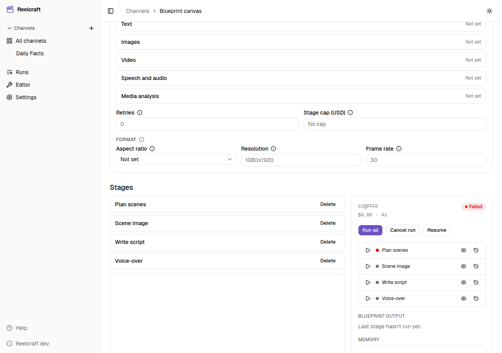

# Reelcraft

[](https://github.com/napstar-420/reelcraft/actions/workflows/ci.yml)
[](https://github.com/napstar-420/reelcraft/actions/workflows/docs.yml)
[](https://github.com/napstar-420/reelcraft/actions/workflows/release.yml)

Reelcraft makes AI videos and reels from a recipe you build once and run as often as you like.
It runs on your own machine, and you use it in the browser.



## What it does

Three ideas cover the whole product:

- **Channel**: a show or account you make videos for. It holds your characters, assets and default settings.
- **Blueprint**: the recipe. A list of **stages** that run in order, such as write a script, make images,
  record a voice-over, put the video together. Each stage can use what the stages before it made.
- **Run**: one video made from a blueprint, with its own inputs. You can watch it, approve or fix a stage
  half-way through, edit the timeline by hand, and download the result.

Every run has a spending cap, and a free **fake provider** produces placeholder results, so you can
build and test a blueprint without paying for anything.

## Quick start (development)

You need Node.js 22+, pnpm 9 and Docker.

```bash
cp .env.example .env
docker compose up -d      # Postgres, MinIO (file storage) and Inngest (background jobs)
pnpm install
pnpm db:migrate
pnpm dev                  # API on :3000, web app on :5173
```

Open http://localhost:5173, create a channel, add a blueprint, and start a run. The default provider is
the fake one, so it costs nothing and needs no API keys.

## Run the packaged app

The same app ships as one Docker image with everything inside it:

```bash
docker run -d --name reelcraft --restart unless-stopped \
  -p 8080:8080 -v reelcraft-data:/data zohaibkhan97/reelcraft
```

Then open http://localhost:8080. How the image, the in-app updater and releases work is in
[`docs/self-hosting.md`](docs/self-hosting.md).

## Repo map

| Path                            | What is in it                                                                      |
| ------------------------------- | ---------------------------------------------------------------------------------- |
| `apps/api`                      | The backend (NestJS): REST and live-event API, database schema, background jobs    |
| `apps/web`                      | The web app (React + Vite): channels, the blueprint canvas, runs, timeline editor  |
| `apps/render-worker`            | Renders the final video with Remotion                                              |
| `apps/docs`                     | The user guide (Docusaurus), published to GitHub Pages. Not in the pnpm workspace  |
| `packages/shared`               | Zod schemas and types shared by the API and web app. The source of truth for shape |
| `packages/timeline-composition` | The Remotion composition used for both the editor preview and the final render     |
| `docker/app`                    | The self-hosted image: Dockerfile, services, in-app updater                        |
| `scripts/release`               | Release manifest building and signing                                              |
| `docs/`                         | Design spec, decision records, self-hosting notes, development notes               |

## Commands

```bash
pnpm dev              # API and web app together
pnpm typecheck        # TypeScript across the whole repo
pnpm lint             # ESLint
pnpm format:check     # Prettier (pnpm format fixes)
pnpm test             # unit tests: shared, API, web
pnpm test:e2e         # API end-to-end tests; need Postgres from docker compose
pnpm test:release     # release signing and updater tests
pnpm db:generate      # create a migration after changing the schema
pnpm db:migrate       # apply migrations
```

Run one API test file: `pnpm --filter @reelcraft/api test -- path/to/file.test.ts`.

## How it fits together

- The **web app** talks to the **API** over REST, and follows a run live through server-sent events.
- Starting a run does not run it inside the request. The API writes the action to Postgres, and
  **Inngest** (a job runner that survives restarts) carries the run through its stages one by one.
- Stages call AI **providers** through adapters (OpenRouter, fal, ElevenLabs, Deepgram, Codex, and the
  fake one). Provider keys are read through `KEY_PROVIDER`: the environment first, then keys saved in
  **Settings**. Never put keys in code, fixtures or commits.
- Generated files go to **MinIO**, an S3-compatible store. Money is stored as exact decimals and always
  goes through `toUsd` and `fromUsd` in `apps/api/src/common/money.ts`.
- Settings that apply to every stage can be set on the channel, the blueprint or the stage. The most
  specific one wins.

The rules to follow when changing code (module boundaries, the delete cascade, artifact replacement)
are in [`CLAUDE.md`](CLAUDE.md).

## Docs

- [`CLAUDE.md`](CLAUDE.md): conventions, structure and rules for every change
- [`docs/self-hosting.md`](docs/self-hosting.md): the image, updater, releases and Settings
- [`docs/adr/`](docs/adr/README.md): why the big choices were made
- [`docs/development-notes.md`](docs/development-notes.md): gotchas, local acceptance checks, Codex and
  BrowserOS notes
- [`docs/ai-video-engine-design-spec-v6.md`](docs/ai-video-engine-design-spec-v6.md) and
  [`docs/ai-reel-engine-requirements.md`](docs/ai-reel-engine-requirements.md): the design and requirements
- [User guide](https://napstar-420.github.io/reelcraft/docs/), source in [`apps/docs`](apps/docs/README.md)

## Contributing

- Use conventional commits: `feat(api): ...`, `fix(web): ...`, `docs: ...`.
- Do not edit versions or `CHANGELOG.md`. release-please builds them from commit subjects, and merging
  its release PR publishes the release.
- If you change `docker/app/Dockerfile`, `docker/app/rootfs/` or the `@remotion/renderer` version, bump
  `docker/app/RUNTIME_VERSION`. CI checks this.
- CI runs the shared build, typecheck, lint, format check, unit tests and API end-to-end tests. Run
  `pnpm typecheck && pnpm lint && pnpm format:check && pnpm test` before you push.
- Change the user guide in `apps/docs` whenever setup, Settings or update behaviour changes.

## Status

Working today: channels with characters and assets, the blueprint canvas with versions, all stage types,
runs with budgets, approvals, retries and dry runs, the timeline editor and renderer, Settings, and the
in-app updater with signed releases.

Not built yet: live updates over websockets (runs use server-sent events), real-money runs against every
provider are only partly verified, and the app has no login. Keep it on a trusted machine.
