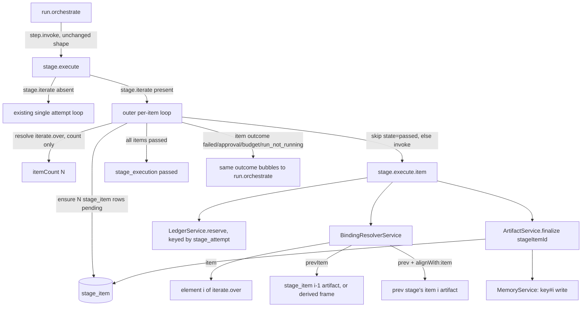
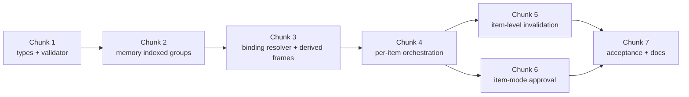

# Phase 7 — Iteration

Status: implementation plan
Baseline: `main` at `1993dec` (Phase 6 merged)
Scope: `iterate`, sequential per-item execution, the `prevItem` carry with derived
frames, per-item retry and budget, partial resume, item-level invalidation, and
item-mode approval. No UI work; no Phase 8 (characters) or Phase 9 (editor)
scope.

## Outcome

At the end of this phase, a stage may declare `iterate` and run its capability
once per element of a resolved array, strictly in order, each item independently
retried, checked, QC'd (if permitted), and budgeted, with completed items never
regenerated or recharged on resume. `{from:'item'}`, `{from:'prevItem'}`, and
`{from:'prev', alignWith:'item'}` resolve for real, including the ffmpeg-backed
`lastFrame`/`firstFrame` derived-frame shortcut. Retrying one item invalidates
only its true dependents — later items of the _same_ stage only when that stage
itself reads `prevItem`, and aligned downstream items pointwise, never the whole
downstream stage. Item-mode approval (`approval.mode: 'item'`) gates each clip
before the next is generated from its last frame.

## Locked product decisions

These are made here, not reopened per-chunk:

1. **One Inngest function stays the per-stage entry point.** `run.orchestrate`
   continues to `step.invoke` a single `stage.execute` per stage, iterating or
   not, and keeps branching on the exact same outcome shape
   (`passed|failed|approval_required|input_required|budget_blocked|run_not_running`)
   it does today. Iteration is invisible to `run-orchestrate.fn.ts`. See
   Chunk 3 for the justification against a flatter single-loop design.
2. **`{from:'item'}`'s element type, for validation, is restricted to a `data`
   array source.** Iterating over a `many`-cardinality media source is not
   validated in this phase (no worked example needs it) — see Open Decisions.
3. **Run Memory indexed-group writes/reads (`key#i`, aggregate `key`) are
   in scope and required**, not deferred — the worked examples
   (`shots`→`broll`→`timeline`) depend on them, and the resolver already
   carries an explicit "phase 7" TODO comment naming this exact gap.
4. **`{from:'prev'}` without `alignWith:'item'` targeting a stage that iterates
   is a new validator error.** No `stage_execution`/`artifact` row is ever
   written with `item_index IS NULL` for an iterating producer, so this
   binding can never resolve at run time; catching it at save time is strictly
   better than a run-time "no active artifact" throw. Not explicitly listed in
   the spec's §16.2 table, but confirmed as in-scope — see Resolved Decisions.
5. **`stage_item.costUsd`/`attemptCount` are populated on item finalize**,
   mirroring `stage_execution`'s columns of the same name (which today are
   dead/unwritten — confirmed by grep — so this phase does not need to retrofit
   stage-level cost rollups, only get the item-level ones right going forward).
6. **`stageExecution.outputArtifactId` is set to the last item's artifact ID**
   when an iterating stage completes, as a convenience pointer only. The
   sanctioned consumption paths remain Run Memory (`writes`) and
   `{from:'prev', alignWith:'item'}` — nothing is expected to read this pointer
   for an iterating stage's real value. Confirmed — see Resolved Decisions.
7. **`prevItem` on a required slot with no fallback is always a validator
   error** — there is no config-level escape hatch. A capability that wants to
   tolerate item 0's `undefined` must declare the slot `required: false` and
   supply its own default (exactly how `video.generate`'s `startFrame` already
   works). §14.4's "or supply a fallback via config" is read as "make the slot
   optional," not as a new mechanism. See Resolved Decisions.
8. **`iterate.groupKey` is reserved, not implemented.** The field stays in the
   zod schema (nothing reads it), marked with a doc comment. See Resolved
   Decisions.
9. **A rejected item, with no `onReject.retryStageKey`, retries that same
   item by default** — the item-mode analogue of stage-mode's existing
   default. See Resolved Decisions.

## Current baseline — what's already item-aware and what's still a stub

Confirmed by direct reading, not assumed:

| Area                                              | State                                                                                                                                                                                                                                                                                                      |
| ------------------------------------------------- | ---------------------------------------------------------------------------------------------------------------------------------------------------------------------------------------------------------------------------------------------------------------------------------------------------------- |
| `stage_item` table                                | Exists in full (`execution.ts:40-56`): id, stageExecutionId, itemIndex, state, attemptCount, outputArtifactId, costUsd, unique `(stageExecutionId, itemIndex)`. **No migration needed** for the base table.                                                                                                |
| `stage_attempt.stageItemId`                       | Already nullable FK with the `coalesce(...,'')` unique index built for exactly this phase (`execution.ts:64-70`).                                                                                                                                                                                          |
| `stageExecution.isIterating`/`itemCount`          | Already present, unused.                                                                                                                                                                                                                                                                                   |
| `artifact.itemIndex`/`artifact.derived`           | Already present (`artifact.ts:33,40`), unused by any writer.                                                                                                                                                                                                                                               |
| `run_memory.writtenItem`                          | Already present, already correctly consulted by `MemoryService.appendTombstones` for item-scoped tombstoning. **Not** yet used to suffix the `memKey` actually written (Chunk 2 gap).                                                                                                                      |
| `humanWait.stageItemId`                           | Already present, unused.                                                                                                                                                                                                                                                                                   |
| `ArtifactService.finalize()`                      | Already accepts `itemIndex` and stales/activates per-`(runId, producerStageKey, itemIndex)` correctly. Still unconditionally repoints `stage_execution.outputArtifactId`/`attemptCount` regardless of itemIndex — wrong for an item finalize (Chunk 3).                                                    |
| `ExecCtx.itemIndex`                               | Already on the interface (`capability.interface.ts:21`), never populated by `buildExecCtx`.                                                                                                                                                                                                                |
| `BindingScope.itemIndex`                          | Already on the interface, never populated by any caller.                                                                                                                                                                                                                                                   |
| `ConfigLayer.iterate.{itemRetryLimit,maxItems}`   | Already in the zod schema (`config-layer.ts:37-42`) and **not** yet projected from `StageDef.iterate` by `stage-def-layer.ts`, and **not** yet read by `ConfigResolverService.effectiveStageConfig`.                                                                                                       |
| `EngineConfig.iterateMaxItems`                    | Already implemented, reads `ITERATE_MAX_ITEMS` (the engine-wide default-50 floor).                                                                                                                                                                                                                         |
| `StageDef.iterate`                                | Missing `maxItems` in the zod schema (`stage-def.ts:28-36`) despite `ConfigLayer` already anticipating it.                                                                                                                                                                                                 |
| `Ref` (`item`/`prevItem`/`prev+alignWith`)        | Fully typed (`ref.ts`).                                                                                                                                                                                                                                                                                    |
| `BindingResolverService`                          | Throws a named "not implemented until phase 7" error for `item`/`prevItem`. `resolveEnvelope` has no branch for them either.                                                                                                                                                                               |
| `validation-context`/`binding-types.ts`           | Same explicit "not implemented until phase 7" stub for the validator's `sourceTypeOfRef`.                                                                                                                                                                                                                  |
| `BlueprintValidatorService`                       | Already enforces `approval.mode:'item'` requires `stage.iterate` (`blueprint-validator.service.ts:379-385`) — a phase-4-era forward guard. Nothing else iterate-specific exists yet.                                                                                                                       |
| `stage-runner.service.ts` / `stage-execute.fn.ts` | Single non-item attempt loop only. Every query that scopes to "this stage's own attempts" filters `isNull(stageAttempt.stageItemId)` — deliberately, per its own comments, so it does not need to change shape, only gain item-scoped siblings.                                                            |
| `LedgerService`                                   | Reservations are keyed by `stageAttemptId`, and `stageCommittedUsd` sums by `(runId, stageKey, category)` across every attempt of that stage. **Both already generalize to per-item attempts with zero code changes** — an item's attempt is just another `stage_attempt` row against the same `stageKey`. |
| `invalidation-closure.ts`                         | Pure, stage-keyed only. No item dimension at all — the single biggest structural change in this phase.                                                                                                                                                                                                     |
| `video.generate` capability                       | Already declares an optional `startFrame` slot accepting `media.image` (`media-generate.capability.ts:89`) — exactly what `{from:'prevItem', path:'lastFrame'}` needs to bind into. No capability change required.                                                                                         |
| `FakeProviderAdapter`                             | Has no video-fixture branch in `fetch()` (only image/audio fixtures). `params.fakeOutput` still works for video by supplying a `MediaSource` with `localPath` directly — used for the acceptance test (Chunk 7).                                                                                           |

This means the phase is almost entirely _logic_, not schema: the only new
migration needed is one additive column (below). Everything else phase 4/6
already forward-built.

## Cross-cutting architecture



---

## Chunk 1 — Types, config layer, and validator completion

### Goal

Land every static/type-level piece so later chunks have a stable, fully-typed
surface to implement against, and so the validator can reject malformed
`iterate` blueprints before any engine work exists to run them.

### Implementation

1. **`packages/shared/src/stage-def.ts`** — add `maxItems: z.number().optional()`
   to the `iterate` object (alongside `over`, `groupKey`, `itemAlias`,
   `alignWith`, `itemRetryLimit`). Leave `itemRetryLimit` required (unchanged).
   Add a doc comment on `groupKey` marking it reserved/unimplemented (Resolved
   Decision 1) — the engine and validator must not reference it anywhere in
   this phase. Export nothing new; `StageDef['iterate']` remains the type
   other files reference.
2. **`packages/shared/src/config-layer.ts`** — no change; `iterate.maxItems`
   and `iterate.itemRetryLimit` already exist there.
3. **`apps/api/src/run-config/stage-def-layer.ts`** — project
   `stage.iterate` into the layer, mirroring how `retryLimit` is projected:
   ```ts
   ...(stage.iterate !== undefined && {
     iterate: {
       itemRetryLimit: stage.iterate.itemRetryLimit,
       ...(stage.iterate.maxItems !== undefined && { maxItems: stage.iterate.maxItems }),
     },
   }),
   ```
4. **`apps/api/src/run-config/config-resolver.service.ts`** —
   `EffectiveStageConfig` gains:
   ```ts
   iterate?: { itemRetryLimit: number; maxItems: number };
   ```
   populated only when `stage.iterate` is declared:
   ```ts
   const iterate = stage.iterate
     ? {
         itemRetryLimit: layer.iterate?.itemRetryLimit ?? stage.iterate.itemRetryLimit,
         maxItems:
           layer.iterate?.maxItems ?? stage.iterate.maxItems ?? this.engineConfig.iterateMaxItems,
       }
     : undefined;
   ```
   This requires injecting `EngineConfig` into `ConfigResolverService` (it
   isn't today) — add the constructor param and update its Nest module
   providers if `ConfigResolverService` isn't already in the same module as
   `EngineConfig` (it is; both are provided at the app root per `EngineConfig`
   being injected all over).
5. **`apps/api/src/db/schema/execution.ts`** — add one column for
   observability parity with `stage_execution.failure`:
   ```ts
   failure: jsonb('failure'), // on stage_item, mirrors stage_execution.failure
   ```
   New Drizzle migration `00XX_stage_item_failure.sql` + snapshot. This is the
   **only** schema migration in this phase.
6. **Blueprint validator — new rules, all in `blueprint-validator.service.ts`
   plus `binding-types.ts`**:

   a. **`sourceTypeOfRef` (`binding-types.ts`)** — replace the `case 'item':
case 'prevItem':` stub:

   ```ts
   case 'item': {
     const stage = ctx.graph[stageIndex];
     if (!stage?.iterate) return unresolved('{from:"item"} on a non-iterating stage', issuePath);
     const overType = sourceTypeOfRef(stage.iterate.over, ctx, stageIndex, issuePath);
     if (overType.issue) return overType;
     if (overType.type.kind !== 'data' || overType.type.schema.type !== 'array' || !overType.type.schema.items) {
       return unresolved('iterate.over does not narrow to an array schema', `stages.${stage.key}.iterate.over`);
     }
     return { type: { kind: 'data', schema: overType.type.schema.items } };
   }
   case 'prevItem': {
     const stage = ctx.graph[stageIndex];
     if (!stage?.iterate) return unresolved('{from:"prevItem"} on a non-iterating stage', issuePath);
     return { type: sourceTypeOfOutput(stage.output) };
   }
   ```

   Note `sourceTypeOfOutput` must be exported (it's currently a private
   helper in `binding-types.ts` — no change needed, it's in the same file).

   b. **`iterate.over` array-narrowing check** — new `checkIterate(stage, ctx,
stageIndex, issues)` method, called from `validateStage`:

   ```ts
   if (!stage.iterate) return;
   const overResult = resolveBoundType(stage.iterate.over, ctx, stageIndex, `${base}.iterate.over`);
   if (
     !overResult.issue &&
     (overResult.type.kind !== 'data' || overResult.type.schema.type !== 'array')
   ) {
     issues.push({
       path: `${base}.iterate.over`,
       message: 'iterate.over does not narrow to an array schema',
       severity: 'error',
     });
   }
   ```

   c. **`prevItem` required rule (§14.4, strict reading — Resolved Decision 2)**
   — for every slot/context binding and every check `refs` entry with
   `ref.from === 'prevItem'`: error unconditionally if the SLOT is
   `required: true` (context/check refs are always effectively required,
   so `prevItem` there is always an error). There is no config-level
   escape hatch — `stage.config` is never consulted by this rule. A
   capability that needs to tolerate item 0's `undefined` must declare the
   slot `required: false` and supply its own default, exactly as
   `video.generate`'s `startFrame` already does. Concretely:

   ```ts
   // slot required:true bound to {from:'prevItem'} -> always an error
   // context/check ref bound to {from:'prevItem'} -> always an error
   // slot required:false bound to {from:'prevItem'} -> fine, no rule fires
   ```

   d. **`alignWith:'item'` validity + canonicalization equality (§14.3)** —
   new `checkAlignWith(stage, ctx, stageIndex, issues)`:
   - Any ref with `alignWith: 'item'` (only `{from:'prev'}` carries this
     field) requires `stage.iterate` to be declared AND the previous stage
     to declare `iterate` too — error otherwise (both directions).
   - When `stage.iterate` is declared and the previous stage also iterates,
     canonicalize both `iterate.over` Refs per the §14.3 table and require
     equality:
     ```ts
     type Canonical = { producerKey: string; path: string };
     function canonicalize(
       ref: Ref,
       ctx: ValidationContext,
       stageIndex: number,
     ): Canonical | { error: string } {
       switch (ref.from) {
         case 'prev': {
           const prevStage = ctx.graph[stageIndex - 1];
           if (!prevStage) return { error: 'no preceding stage' };
           return { producerKey: prevStage.key, path: ref.path ?? '$' };
         }
         case 'memory': {
           const writer = ctx.memoryWriters.get(ref.key)?.[0];
           if (!writer) return { error: `memory key "${ref.key}" has no writer` };
           return { producerKey: writer.stageKey, path: writer.path + (ref.path ?? '') };
         }
         case 'input':
           return { producerKey: `$input:${ref.inputKey}`, path: ref.path ?? '$' };
         default:
           return { error: `${ref.from} is not permitted as an iterate.over for an aligned pair` };
       }
     }
     ```
     Compare `canonicalize(stage.iterate.over, ...)` against
     `canonicalize(prevStage.iterate.over, ...)` for every stage whose OWN
     `iterate.over` uses `alignWith`-relevant plumbing — actually the
     canonicalization applies to the two stages' `iterate.over` Refs
     directly (not to the individual `alignWith` binding), per the spec
     table. Emit an error at `${base}.iterate.over` when they differ.
   - `{from:'const'}` as `iterate.over` on a stage that also has a
     downstream `alignWith:'item'` consumer: flag as an error at the
     _consumer's_ path (the const-sourced stage itself isn't wrong to
     iterate over a const array; it's just never a legal alignment target).

   e. **`{from:'prev'}` (no `alignWith`) targeting an iterating previous
   stage** — new check alongside the existing `checkFirstStagePrev`:

   ```ts
   if (ref.from === 'prev' && !ref.alignWith) {
     const prevStage = stageIndex > 0 ? ctx.graph[stageIndex - 1] : undefined;
     if (prevStage?.iterate) {
       issues.push({
         path,
         message: `{from:'prev'} cannot bind an iterating stage's output — use {alignWith:'item'} (if this stage also iterates) or Run Memory`,
         severity: 'error',
       });
     }
   }
   ```

   f. **`cardinality` vs. iterating producer (§16.2)** — extend the existing
   slot-compatibility loop in `validateStage`. Alongside the existing
   `isCompatible` call, add:

   ```ts
   const producerArity = arityOf(ref, ctx, stageIndex); // 'scalar' | 'many' | undefined (unresolved)
   if (producerArity === 'many' && slotDef.cardinality === 'one') {
     issues.push({
       path,
       message: `cardinality:'one' slot bound to an iterating producer`,
       severity: 'error',
     });
   }
   if (producerArity === 'scalar' && slotDef.cardinality === 'many') {
     issues.push({
       path,
       message: `cardinality:'many' slot bound to a scalar source`,
       severity: 'error',
     });
   }
   ```

   `arityOf`: `'many'` for `{from:'memory', key}` where `key` (bare, no
   `#i` suffix) is written by an iterating stage; `'scalar'` for
   `{from:'memory', key: '...#N'}`, `{from:'item'}`, `{from:'prevItem'}`,
   `{from:'prev', alignWith:'item'}`, and every other existing ref kind.
   Scoped to memory/iterate-derived arity only, per Locked Decision 2 —
   pre-existing many-cardinality _inputs_ are out of scope for this rule.
   When `stage.iterate.over` itself resolves to a `many`-cardinality media
   source (out of scope for this phase — Locked Decision 2), emit a
   distinct message — `iterate.over a many-cardinality media source is not
yet supported` — rather than letting the generic array-narrowing/
   cardinality error fire, so this reads as a deliberate phase boundary and
   not an authoring mistake (Resolved Decision 5).

### Primary files

- `packages/shared/src/stage-def.ts`
- `apps/api/src/run-config/stage-def-layer.ts`
- `apps/api/src/run-config/config-resolver.service.ts`
- `apps/api/src/db/schema/execution.ts` + new migration/snapshot
- `apps/api/src/blueprint/binding-types.ts`
- `apps/api/src/blueprint/blueprint-validator.service.ts`
- `apps/api/src/blueprint/validation-context.ts` (only if `arityOf` needs a
  new context lookup beyond `memoryWriters`, e.g. a `Map<stageKey, StageDef>`
  — `stageIndexByKey` + `graph` already suffice, likely no change needed)

### Tests and exit criteria

- `apps/api/src/blueprint/blueprint-validator.test.ts` — new cases: valid
  `broll`-shaped stage passes; `iterate.over` bound to a non-array `data`
  schema fails; `prevItem` on a required slot with no `iterateFallback` fails,
  with fallback passes; `alignWith:'item'` on a non-iterating consumer fails;
  `alignWith:'item'` where the previous stage doesn't iterate fails;
  mismatched canonicalized `iterate.over` pair fails; matching pair passes;
  `{from:'prev'}` (no alignWith) targeting an iterating stage fails;
  `cardinality:'one'` bound to a memory group read fails; `cardinality:'many'`
  bound to `{from:'item'}` fails.
- `pnpm --filter @reefcraft/api typecheck` after the `StageDef`/`ConfigLayer`
  changes (nothing downstream should break — every consumer already treats
  `iterate` as optional).
- Migration applies cleanly against a database at the current head.

---

## Chunk 2 — Run Memory indexed groups

### Goal

Make `StageDef.writes` on an iterating stage actually produce `key#0…key#N-1`
entries, and make `{from:'memory', key}` (bare) aggregate them into the
ordered array §6.3 promises — this is a prerequisite for Chunk 3's per-item
loop (`shots`→`broll`) and for Chunk 4's item-level invalidation (which needs
per-index memory versions to exist at all).

### Implementation

1. **`apps/api/src/artifact/memory.service.ts` — `buildWriteCallback`**:
   when `source.itemIndex !== undefined`, the `memKey` column actually
   written is `` `${memKey}#${source.itemIndex}` ``; `writtenItem` continues
   to record the bare index (unchanged — `appendTombstones` already matches
   on it). No other line changes: `nextVersion` already operates per exact
   `memKey` string, so `keyframe#0` and `keyframe#1` naturally get independent
   version sequences.
2. **`apps/api/src/artifact/memory.service.ts`** — add
   `async listGroupCurrent(executor, runId, baseKey): Promise<MemoryRow[]>`:
   selects every current (non-tombstoned, highest-version) row whose `memKey`
   matches `` `${baseKey}#` `` followed by a non-negative integer, ordered by
   the numeric suffix. A read that resolves to zero rows (all tombstoned or
   never written) throws — per §6.3, "a read resolving to nothing but
   tombstones is a runtime error."
3. **`apps/api/src/artifact/binding-resolver.service.ts` — `fetchMemoryRow` /
   the `case 'memory':` branch in `resolve()`**: change resolution order to:
   - Try an exact `memKey` match first (covers plain non-iterating writes
     _and_ an explicit `key#i` read — no schema change needed, `ref.key` is
     already a free-form string).
   - If no exact match, try `listGroupCurrent(..., ref.key)`. If that returns
     rows, build the ordered array: for `data`/`text` kinds, `row.data`
     per row (or `getPath(row.data, ref.path)` if `ref.path` given, applied
     per element); for media kinds, a manifest per row via the existing
     `mediaManifest`/`blobManifest` helpers.
   - Provenance for a group read is a **list**, not a single version: extend
     `RefProvenance` with an optional field:
     ```ts
     memoryVersions?: Array<{ itemIndex: number; version: number }>;
     ```
     (keep `memoryKey`/`memoryVersion` as-is for the singular case — group
     reads populate `memoryVersions` instead and leave `memoryVersion`
     undefined). This is what Chunk 4's closure needs to see per-item writers.
   - If truly nothing matches either form, keep today's error (message
     already anticipates the `#0` suffix form).
4. **`resolveEnvelope`** — the group-read case wraps as `{kind:'literal',
data: <array>}` for a `data`-sourced group (matches how a `const` array
   would be treated by a script check); media-sourced groups keep their real
   kind by reusing the same manifest array as `resolve()`'s value with
   `kind: 'literal'` at the envelope level too (a script check inspecting an
   array of manifests already has each manifest's own `kind` field to branch
   on — no special envelope kind needed for the container).

### Primary files

- `apps/api/src/artifact/memory.service.ts`
- `apps/api/src/artifact/binding-resolver.service.ts`

### Tests and exit criteria

- New `apps/api/src/artifact/memory.service.test.ts` (or extend existing
  coverage if present) — indexed write produces `key#i`; `appendTombstones`
  still correctly tombstones only the invalidated indices; a group read
  after a partial re-run (fewer items) reflects the tombstoned set, not the
  original count (the exact §6.3 orphan scenario).
- New binding-resolver unit tests: bare-key group read returns an ordered
  array with correct `memoryVersions` provenance; explicit `key#3` read
  returns a single value with `memoryVersion` provenance (unchanged shape);
  a read where every indexed entry is tombstoned throws.
- Existing Phase 2–6 memory tests remain green (bare non-iterating writes are
  unaffected — `source.itemIndex === undefined` keeps writing the un-suffixed
  key exactly as before).

---

## Chunk 3 — Binding resolver: `item`, `prevItem`, `prev+alignWith`, derived frames

### Goal

Make every new `Ref` variant resolve for real, including the ffmpeg-backed
derived-frame shortcut, without adding a new Inngest step boundary (frame
extraction runs inside the existing `reserveAndSubmit`/`fetchAndFinalize`
step, exactly like `TimelineResourceResolverService.resolve()` already does
for other ffmpeg-adjacent work).

### Implementation

1. **`BindingScope` (`binding-resolver.service.ts`)** — add two fields
   (`itemIndex` already exists):
   ```ts
   stageKey?: string | undefined;        // the CURRENTLY executing stage's own key
   iterateOverValue?: unknown[] | undefined; // resolved element array, cached per resolveAll() call
   ```
2. **`resolve()` — `case 'item':`**
   ```ts
   case 'item': {
     if (ctx.itemIndex === undefined) throw new Error('BindingResolverService: {from:"item"} outside an iterating attempt');
     const array = ctx.iterateOverValue;
     if (!array) throw new Error('BindingResolverService: iterateOverValue not provided in scope');
     const element = array[ctx.itemIndex];
     const value = ref.path ? getPath(element, ref.path) : element;
     return { value, provenance: { ref } };
   }
   ```
3. **`resolve()` — `case 'prevItem':`**
   ```ts
   case 'prevItem': {
     if (ctx.itemIndex === undefined || !ctx.stageKey) throw new Error(...);
     if (ctx.itemIndex === 0) return { value: undefined, provenance: { ref } };
     const row = await this.fetchItemArtifact(ctx.runId, ctx.stageKey, ctx.itemIndex - 1);
     if (ref.path === 'lastFrame' || ref.path === 'firstFrame') {
       const frame = await this.derivedFrames.extract(row, ref.path);
       return { value: frame, provenance: { ref, artifactId: row.id } };
     }
     // same kind-dispatch as the 'prev' branch: media manifest / blob manifest / unwrapped data
     ...
     return { value, provenance: { ref, artifactId: row.id } };
   }
   ```
4. **`resolve()` — `case 'prev':`** — when `ref.alignWith === 'item'`, fetch
   via `eq(artifact.itemIndex, ctx.itemIndex)` instead of
   `isNull(artifact.itemIndex)`. Refactor `fetchPrevArtifact` to accept an
   optional `itemIndex` override:
   ```ts
   private async fetchPrevArtifact(ctx: BindingScope, itemIndex?: number) { ... }
   ```
5. **New `fetchItemArtifact(runId, stageKey, itemIndex)`** — same shape as
   `fetchPrevArtifact` but keyed on `producerStageKey = stageKey` (the
   _current_ stage, not the previous one) and `itemIndex = itemIndex`.
6. **`resolveAll()`** — before resolving slots/context, when `stage.iterate`
   is declared, resolve `stage.iterate.over` once via the existing `resolve()`
   path, assert `Array.isArray(result.value)` (defensive — the validator
   already enforces this at save time), and set `ctx.iterateOverValue =
result.value` for the rest of the call. Also assert `N === (stage.iterate
effective).maxItems` bound isn't exceeded here — no, that check belongs to
   the orchestrator (Chunk 4), which needs the count _before_ creating
   `stage_item` rows, not buried inside per-attempt binding resolution.
7. **New `DerivedFrameService`** (`apps/api/src/artifact/derived-frame.service.ts`):
   ```ts
   @Injectable()
   export class DerivedFrameService {
     constructor(
       private readonly db, private readonly workspaces: WorkspaceService,
       @Inject(STORAGE_ADAPTER) private readonly storage, private readonly probes: MediaProbeService,
     ) {}
     async extract(row: artifact row, which: 'firstFrame' | 'lastFrame'): Promise<MediaManifest> {
       const cached = (row.derived as Record<string, string> | null)?.[which];
       if (cached) return this.manifestFor(cached, ...);
       return this.db.transaction(async (tx) => {
         const [locked] = await tx.select().from(artifact).where(eq(artifact.id, row.id)).for('update');
         const already = (locked.derived as Record<string, string> | null)?.[which];
         if (already) return this.manifestFor(already, ...);
         const blobId = await this.extractAndStore(tx, locked, which);
         await tx.update(artifact).set({ derived: sql`coalesce(${artifact.derived}, '{}'::jsonb) || ${JSON.stringify({ [which]: blobId })}::jsonb` }).where(eq(artifact.id, row.id));
         return this.manifestFor(blobId, ...);
       });
     }
     private async extractAndStore(tx, row, which) {
       return this.workspaces.withWorkspace(row.runId, async (ws) => {
         const source = await ws.pull(sourceObjectKeyOf(row));
         const frame = path.join(ws.dir, `${which}.png`);
         const args = which === 'firstFrame'
           ? ['-y', '-i', source, '-frames:v', '1', frame]
           : ['-y', '-sseof', '-0.1', '-i', source, '-frames:v', '1', frame];
         await execFileAsync('ffmpeg', args);
         const bytes = await readFile(frame);
         const blobId = ulid();
         const key = objectKey.derivedFrame(ownerId, channelId, row.runId, blobId);
         await this.storage.put(key, createReadStream(frame), { mime: 'image/png' });
         await tx.insert(blob).values({ id: blobId, scope: 'run', runId: row.runId, bucket: '', objectKey: key, mime: 'image/png', bytes: bytes.length, sha256: ..., etag: put.etag });
         return blobId;
       });
     }
   }
   ```
   The row lock (`SELECT ... FOR UPDATE` on the artifact row) is the
   concurrency guard for "extracted on first access" — a second racing caller
   blocks until the first commits the `derived` update, then sees the cached
   value. `-sseof -0.1` for `lastFrame` reads from 0.1s before end-of-stream,
   a standard ffmpeg idiom for "last frame" without needing the exact
   duration up front (works off the container's own EOF).
8. **`objectKey.derivedFrame(ownerId, channelId, runId, blobId)`** — add to
   `object-key.ts`, pattern `${ownerId}/${channelId}/${runId}/derived/${blobId}.png`.
9. **`StageRunnerService`** — `buildExecCtx` sets `itemIndex: ctx.itemIndex`
   (wire the already-existing `ExecCtx.itemIndex` field); `resolveBindings`
   gains an `itemIndex?: number` param threaded into `BindingScope` along with
   `stageKey: stage.key`.
10. **`resolveEnvelope`** — add explicit `case 'item':`/`case 'prevItem':`
    branches (do not fall through to the generic default), mirroring `'prev'`
    for `prevItem` (real `ArtifactKind` envelope, including derived-frame
    extraction when the check ref itself asks for `path: 'lastFrame'`), and
    wrapping `'item'` as `{kind:'literal', ...}` per the resolve() value
    (documented limitation for many-media iterate sources — Open Decisions).

### Primary files

- `apps/api/src/artifact/binding-resolver.service.ts`
- new `apps/api/src/artifact/derived-frame.service.ts`
- `apps/api/src/storage/object-key.ts`
- `apps/api/src/orchestration/stage-runner.service.ts` (`buildExecCtx`,
  `resolveBindings`)
- `apps/api/src/artifact/artifact.module.ts` (register `DerivedFrameService`)

### Tests and exit criteria

- Unit tests (mocking ffmpeg via a thin injected `execFile` wrapper, or
  skipping the ffmpeg call and asserting only the caching/locking behavior)
  for `DerivedFrameService`: first access extracts and caches into
  `artifact.derived`; second access returns the cached blob without a second
  ffmpeg invocation; concurrent access under the row lock only extracts once.
- Binding-resolver unit tests: `{from:'item'}` indexes correctly, including
  `.path` narrowing; `{from:'prevItem'}` returns `undefined` for item 0 and a
  real value for item ≥1; `{from:'prev', alignWith:'item'}` resolves the
  aligned previous stage's item _i_ artifact, throws when no such item
  artifact exists (misaligned counts — should never happen post-Chunk-4's
  runtime assertion, but must fail loudly, not silently, if it does).
- A real-ffmpeg acceptance path is deferred to Chunk 7's dedicated script
  (this chunk's own tests stay CI-safe and fast).

---

## Chunk 4 — Orchestration: the per-item loop

### Goal

Land the actual sequential per-item execution, budget, and partial resume,
without touching `run-orchestrate.fn.ts`.

### Decision: one dispatcher function, one per-item function — not a flattened single loop

Two designs were considered:

- **(Rejected) Flatten everything into today's `stage.execute`**: wrap the
  existing attempt `while(true)` loop in an outer `for item of items` loop,
  all inside one Inngest function invocation. Simplest diff, but every step id
  (`begin-attempt-*`, `poll-*`, etc.) must additionally be keyed by item index,
  and — more importantly — the function's **step history grows unboundedly
  with item count**: `maxItems` (default 50) × `itemRetryLimit+1` attempts ×
  (~6 steps/attempt incl. poll backoff) is on the order of a thousand-plus
  steps in the worst case, all held in one Inngest run's durable state. This
  is the exact shape of problem Inngest's per-function step/state limits exist
  to catch, and it multiplies with every future item-heavy blueprint.
- **(Chosen) `stage.execute` dispatches; a new `stage.execute.item` function
  (event-less, invoked only via `step.invoke`) runs one item's full
  submit/poll/fetch/check/QC/retry loop as its own Inngest function run**,
  with its own independent step history. `stage.execute` becomes:
  - unchanged inline behavior when `!stage.iterate` (zero regression risk to
    the phase 1–6 path);
  - a thin **outer loop** when `stage.iterate` is set: one step to resolve
    `iterate.over`'s count and assert the maxItems/alignment invariants, one
    step to bulk-create `stage_item` rows, then for `i` in `0..N-1`: one cheap
    step to check `stage_item[i].state` (skip if `'passed'` — this **is**
    §14.5's partial resume, expressed as "skip already-passed items" rather
    than "start the loop at the lowest non-passed index", which is the same
    outcome reached the same way `run.orchestrate` already skips passed
    `stage_execution` rows today), then one `step.invoke` per item.

  This keeps `run.orchestrate` completely unchanged (it still invokes
  `stage.execute` once per stage and branches on the same outcome union), and
  bounds each Inngest function run's own step count to O(N) for the outer
  dispatcher and O(`itemRetryLimit` × constant) for each per-item run —
  matching how `run.orchestrate` itself already stays cheap by delegating the
  expensive part to `step.invoke`d children.

### Implementation

1. **`StageRunnerService`** — every method that currently filters
   `isNull(stageAttempt.stageItemId)` (`beginAttempt`,
   `countSemanticAttemptsUsed`, `countInfraAttemptsUsed`, `loadCritiqueLog`)
   gains an item-scoped counterpart (or an optional `stageItemId` parameter
   that switches the predicate from `isNull(...)` to `eq(...,
stageItemId)`). Prefer parameterizing the existing methods over
   duplicating them — the SQL shape is identical modulo that one predicate.
   `idempotencyKey(ctx, itemIndex)` already accepts `itemIndex`; start
   actually passing it from the item-body caller.
2. **`reserveAndSubmit`/`fetchAndFinalize`** — accept an optional `itemIndex`
   and thread it into `resolveBindings(...)` and `buildExecCtx(...)`. The
   `approval.mode !== 'stage'` throw in `fetchAndFinalize` is replaced: when
   `stage.approval?.mode === 'item'` and `itemIndex !== undefined`, follow the
   same `awaiting_approval` path but write to `stage_item` (state
   `'awaiting_approval'`) instead of `stage_execution`, and open the
   `humanWait` with `stageItemId` set (already supported).
3. **`ArtifactService.finalize()`** — new optional `stageItemId` param.
   When present:
   ```ts
   await tx
     .update(stageItem)
     .set({
       state: 'passed',
       outputArtifactId: params.newArtifactId,
       attemptCount: sql`${stageItem.attemptCount} + 1`,
       costUsd: params.costUsd, // new param, threaded from fetchAndFinalize's result.costUsd
     })
     .where(eq(stageItem.id, params.stageItemId));
   ```
   and **skip** the `stageExecution.outputArtifactId`/`attemptCount` update
   entirely for this path (Locked Decision 6 handles the stage-level pointer
   separately, once, after the whole loop finishes).
4. **New `apps/api/src/orchestration/functions/stage-execute-item.fn.ts`** —
   `buildStageExecuteItemFunction(client, runner)`, `createFunction({id:
'stage.execute.item', retries: 3}, ...)` with **no event trigger** (invoked
   only via `step.invoke`, same registration pattern as any other
   `createFunction` — Inngest allows a function to be invocable without a
   standalone subscribed event as long as it's registered and referenced by
   `step.invoke({ function: ... })`). Body: a straight copy of
   `stage-execute.fn.ts`'s existing attempt `while(true)` loop, parameterized
   by `itemIndex`/`stageItemId`, using `effective.iterate!.itemRetryLimit`
   instead of `effective.retryLimit` for the `isLastAttempt` check, and
   `stage_item` state transitions (`'running'` at start, `'passed'` /
   `'failed'` / `'awaiting_approval'` at the terminal branches) instead of
   `stage_execution` ones. Returns the identical outcome union
   `stage.execute` already returns today.
5. **`stage-execute.fn.ts`** — add the outer branch:
   ```ts
   if (stage.iterate) {
     const { itemCount } = await step.run('resolve-iterate-count', () =>
       runner.resolveIterateCount(data.runId, data.stageExecutionId, stage, effective, prevStageKey),
     );
     await step.run('ensure-stage-items', () =>
       runner.ensureStageItems(data.stageExecutionId, itemCount),
     );
     for (let i = 0; i < itemCount; i += 1) {
       const itemState = await step.run(`check-item-${i}`, () => runner.itemState(data.stageExecutionId, i));
       if (itemState === 'passed') continue;
       const result = await step.invoke(`run-item-${i}`, {
         function: stageExecuteItemFn,
         data: { runId: data.runId, stageExecutionId: data.stageExecutionId, stageKey: data.stageKey, itemIndex: i },
       });
       if (result.outcome !== 'passed') return result; // bubbles unchanged to run.orchestrate
     }
     await step.run('finish-iterating-stage', () => runner.finishIteratingStage(data.stageExecutionId));
     return { outcome: 'passed' as const, artifactId: /* last item's artifactId, from finishIteratingStage */ };
   }
   // ...unchanged non-iterating path below
   ```
6. **New `StageRunnerService` methods**:
   - `resolveIterateCount(runId, stageExecutionId, stage, effective, prevStageKey)`
     — resolves `stage.iterate.over` via `BindingResolverService` (needs
     `runId`/`prevStageKey`/`inputs`/`assetBindings`, no `itemIndex` at this
     point), asserts it's an array, checks `N <= effective.iterate!.maxItems`
     (fail via `failStageExecution('iterate_max_items_exceeded')` and a
     thrown/caught outcome mapped to `{outcome:'failed', ...}` — not a retryable
     condition), and — when `stage.iterate.over` canonicalizes to the same
     producer as an aligned previous iterating stage (per Chunk 1's
     validator-time check having already confirmed the Refs match) —
     **asserts** `N === previousStageExecution.itemCount` before returning
     (§14.3's runtime assertion, "before the first item executes"). Returns
     `{ itemCount: N }` only — never the array contents, keeping the step
     return small per §13.2 Rule 1.
   - `ensureStageItems(stageExecutionId, itemCount)` — `INSERT ... ON CONFLICT
DO NOTHING` for `itemIndex` 0..N-1, all `state: 'pending'`; also sets
     `stageExecution.isIterating = true, itemCount` once.
   - `itemState(stageExecutionId, itemIndex)` — trivial single-row read.
   - `finishIteratingStage(stageExecutionId)` — sets `stage_execution.state =
'passed'`, `endedAt`, and `outputArtifactId` = the last item's
     `outputArtifactId` (Locked Decision 6).
7. **`orchestration/functions/index.ts`** — register `stageExecuteItemFn`
   alongside `stageExecuteFn`, and pass it into `buildStageExecuteFunction`'s
   closure (it needs a reference to invoke).

### Primary files

- `apps/api/src/orchestration/stage-runner.service.ts`
- `apps/api/src/orchestration/functions/stage-execute.fn.ts`
- new `apps/api/src/orchestration/functions/stage-execute-item.fn.ts`
- `apps/api/src/orchestration/functions/index.ts`
- `apps/api/src/artifact/artifact.service.ts`

### Tests and exit criteria

- e2e (`apps/api/test/e2e/phase7-iteration.e2e.test.ts`, Postgres-backed, no
  ffmpeg dependency): a `data`-output iterating stage (e.g., `llm.generate`
  producing one JSON object per item over a `memory:shots`-shaped array) run
  directly against `StageRunnerService`'s new item-scoped methods (same style
  as `phase4-actions.e2e.test.ts`, calling `beginAttempt`/`reserveAndSubmit`/
  `fetchAndFinalize` per item rather than driving through Inngest): asserts
  `stage_item` rows created in `pending`, transitioned to `passed` in order,
  each with its own artifact/cost; asserts a forced item failure (via a
  script check keyed on `{from:'item'}` — see Chunk 7) exhausts
  `itemRetryLimit` and marks that item `'failed'` while items before it stay
  `'passed'` with intact artifacts, and the run driver treats it as
  `FAILED` with `cursorStageKey` on this stage.
- Partial resume test: after the above failure, patch and "resume" by
  re-driving the same item-body logic for the failed index only, asserting
  items 0..k-1 are neither re-invoked (no new `stage_attempt` rows) nor
  recharged (ledger totals unchanged for their reservations).
- Inngest-level test (if the repo has an Inngest test harness/dev server
  already exercised elsewhere — check `stage-execute.fn.ts`'s existing test
  coverage for the pattern to mirror) exercising `stage.execute`'s outer loop
  against `stage.execute.item` end to end for a 3-item stage.
- `pnpm typecheck`, `pnpm lint`, `pnpm test`.

---

## Chunk 5 — Item-level invalidation

### Goal

Extend `computeInvalidationClosure` to the §15.2 item-level rules without
breaking any of its four existing stage-level test cases.

### Design

The current model is one node per `stageKey`. It needs to become one node per
`(stageKey, itemIndex | null)`, where `null` means "this stage's own
non-item-scoped read/write" (covers non-iterating stages unchanged, and an
iterating stage's _own_ `iterate.over` resolution, which is scoped to the
whole stage, not one item).

```ts
export interface ActiveExecutionRead {
  stageKey: string;
  stageExecutionId: string;
  itemIndex?: number; // NEW — undefined for non-iterating stages
  artifactId?: string;
  /** NEW — true iff this stage's declared bindings (any slot/context/check
   * ref) include a {from:'prevItem'} anywhere. Computed by the caller from
   * the StageDef, not derivable from resolved_inputs alone (an item-0
   * attempt never actually resolves a value for it, so provenance alone
   * can't prove the binding exists). */
  bindsPrevItem?: boolean;
  provenance: Record<string, RefProvenance>;
}
```

Algorithm changes in `computeInvalidationClosure`:

1. **Seeding an item retry**: the caller passes a seed identifying
   `{stageKey, itemIndex}` rather than just `stageKey`. Add
   `InvalidationSeed.items?: Array<{ stageKey: string; itemIndex: number }>`.
   A whole-stage retry seed continues to mean "every item of that stage is
   invalid" (Locked by spec: "Retrying a whole iterating stage invalidates
   all its items").
2. **Same-stage propagation**: when item _i_ of stage S is invalid and
   `bindsPrevItem` is true for S, items _i+1..N-1_ of S are added to the
   invalid set (a simple index-range add, computed directly — no graph walk
   needed since it's the same stage). When `bindsPrevItem` is false, only item
   _i_ is added — nothing else of S.
3. **Cross-stage propagation, `{from:'prev'}` with `alignWith:'item'`**: for a
   downstream stage F that reads `{from:'prev', alignWith:'item'}` from S
   (recorded in F's `resolved_inputs` — the `RefProvenance.ref` there already
   carries `alignWith:'item'`), only **F's own item _i_** goes invalid when
   S's item _i_ is invalid — never all of F. This requires each `slots.*`/
   `context.*` provenance entry the caller loads to retain enough of the
   original `Ref` to detect `alignWith` (already true — `RefProvenance.ref`
   is the full `Ref`).
4. **Cross-stage propagation, memory group reads**: a stage reading the bare
   group key (aggregated array) is invalidated as a **whole stage** (all its
   items, if it iterates) whenever ANY of the `memoryVersions` entries it
   recorded reading was written by an invalid `(stageKey, itemIndex)` pair —
   this is the natural generalization of the existing single-`memoryVersion`
   check to the new `memoryVersions` array field from Chunk 2. A stage reading
   an _explicit_ `key#i` single index is invalidated only if that exact
   `(writer stageKey, itemIndex)` pair is invalid.
5. **The existing four stage-level tests must still pass unmodified** —
   achieved by treating "no `itemIndex`" uniformly as its own singleton
   group per stage (equivalent to today's behavior when nothing in the graph
   iterates).

Pseudocode sketch for the revised inner loop:

```ts
type Key = string; // `${stageKey}\0${itemIndex ?? ''}`
const invalid = new Set<Key>(seedKeys);

for (const stageKey of graphOrder) {
  const nodesForStage = byStageKey.get(stageKey) ?? []; // 1 node, or N item-nodes
  for (const node of nodesForStage) {
    const key = keyOf(node);
    if (invalid.has(key)) continue;
    const dependsOnInvalid = Object.values(node.provenance).some((read) => {
      if (read.ref.from === 'prev' && read.ref.alignWith === 'item') {
        return invalid.has(
          keyOf({ stageKey: prevStageKeyOf(stageKey), itemIndex: node.itemIndex }),
        );
      }
      if (read.artifactId && artifactOwnerIsInvalid(read.artifactId)) return true;
      if (read.memoryVersions) {
        return read.memoryVersions.some((v) => invalid.has(keyOf(writerOf(v))));
      }
      if (read.memoryKey !== undefined && read.memoryVersion !== undefined) {
        return invalid.has(keyOf(writerOf({ key: read.memoryKey, version: read.memoryVersion })));
      }
      if (read.inputKey && affectedInputs.has(read.inputKey)) return true;
      return false;
    });
    if (dependsOnInvalid) {
      invalid.add(key);
      if (node.itemIndex !== undefined && node.bindsPrevItem) {
        for (const later of nodesForStage)
          if (later.itemIndex! > node.itemIndex) invalid.add(keyOf(later));
      } else if (node.itemIndex === undefined && isIteratingStage(stageKey)) {
        for (const later of nodesForStage) invalid.add(keyOf(later)); // whole-stage retry/dependency invalidates every item
      }
    }
  }
}
```

`InvalidationService.preview`/`apply` (the DB-facing caller) must be updated
to:

- load `stage_attempt` rows **per item** (join `stage_item`, not just
  `stage_execution`) when a stage iterates, building one `ActiveExecutionRead`
  per item using that item's own active attempt's `resolved_inputs`;
- compute `bindsPrevItem` once per stage from the `StageDef` (not from
  provenance) and attach it to every item-node of that stage;
- `apply()`'s stale-marking/tombstone-append now operates over
  `(stageKey, itemIndex)` pairs, not just `stageKey` — `artifact` staleing
  already supports `itemIndex` (existing `finalize()` predicate shape);
  `stage_item.state` gets set to `'stale'` for invalid items (mirroring
  `stage_execution.state = 'stale'`); `MemoryService.appendTombstones` already
  accepts `InvalidatedMemoryWriter.itemIndex` — pass it through per invalid
  item instead of only per invalid stage.

### Primary files

- `apps/api/src/run/invalidation-closure.ts`
- `apps/api/src/run/invalidation-closure.test.ts`
- `apps/api/src/run/invalidation.service.ts`
- `apps/api/src/artifact/memory.service.ts` (no change beyond Chunk 2 — just
  confirming `appendTombstones`'s existing `itemIndex` matching is exercised)

### Tests and exit criteria

- All four existing `invalidation-closure.test.ts` cases pass unmodified.
- New cases directly encoding §25.4's worked trace: retrying `broll` item 2
  (with `bindsPrevItem: true`) invalidates items 2–5 of `broll`, invalidates
  `timeline`/`draft`/`final` (which read the `memory:broll` group and one of
  its versions is now invalid), and **does not** invalidate `music` (reads
  only `memory:script`).
- Item-independence case: retrying item 2 of a stage that does **not** bind
  `prevItem` leaves items 3–5 of the same stage untouched.
- `alignWith:'item'` pointwise case: item _i_ of an aligned downstream stage
  goes invalid; other items of that downstream stage do not.
- `InvalidationService` integration test (extend
  `apps/api/test/e2e/phase4-actions.e2e.test.ts`'s style or add a new e2e
  file): full `apply()` over a real DB produces item-scoped `stage_item.state
= 'stale'` and correctly indexed memory tombstones.

---

## Chunk 6 — Item-mode approval

### Goal

Wire `approval.mode: 'item'` end to end: the run pauses after each item's
checks pass (before the next item can consume its `lastFrame`), and
approve/reject act on that one item.

### Implementation

1. **`stage-execute-item.fn.ts` / `StageRunnerService.fetchAndFinalize`**
   (built in Chunk 4) — when `stage.approval?.mode === 'item'`, the
   `awaiting_approval` branch sets `stage_item.state = 'awaiting_approval'`
   (not `stage_execution`), opens the `humanWait` with `stageItemId`, and the
   item-body function returns `{outcome: 'approval_required', artifactId}` —
   which the outer loop (Chunk 4) bubbles unchanged to `run.orchestrate`,
   which transitions the run to `PAUSED_APPROVAL` exactly as it does for
   stage-mode approval today. No `run-orchestrate.fn.ts` change needed.
2. **`HumanActionService.approve`/`approveInTransaction`** — generalize to
   accept an optional `itemIndex`:
   - `pendingAttempt` gains an item-scoped variant filtering `eq(stageAttempt.stageItemId, stageItemId)` instead of `isNull(...)`.
   - On approve: `ArtifactService.finalize(..., stageItemId)` (Chunk 4's new
     param) instead of the stage-level finalize; update `stage_item.state =
'passed'` (via finalize's new branch) instead of `stage_execution`;
     `stage_execution` itself is left `'running'` — it only flips to
     `'passed'` once the outer loop's `finishIteratingStage` runs after
     the resumed `run.orchestrate` re-invokes `stage.execute`, whose outer
     loop sees this item now `'passed'` and continues to the next one.
   - `waits.resolve(tx, execution.id)` is unaffected (already
     execution-scoped, and — because iteration is strictly sequential — at
     most one item's wait is ever open per execution at a time).
3. **`HumanActionService.reject`** — for item-mode approval, the natural
   product behavior is: reject retries **this same item** (not the whole
   stage) unless the stage declares `approval.onReject.retryStageKey`
   pointing elsewhere (existing routed-rejection mechanism, unchanged
   semantics, just scoped to the one item's retry-count/critique log rather
   than the whole stage's). This needs:
   - `retryDebits`/critique-log counting scoped by `stageItemId` when
     rejecting an item (new item-scoped variants mirroring Chunk 4's
     `StageRunnerService` changes).
   - The invalidation seed becomes `{ items: [{ stageKey: targetStageKey,
itemIndex }] }` (Chunk 5's new seed shape) instead of `{ stageKeys:
[targetStageKey] }`.
   - `exhausted` check uses `effective.iterate!.itemRetryLimit`, not
     `effective.retryLimit`.
4. **API surface** (`run.controller.ts` / DTOs) — `POST
/runs/:id/stages/:stageKey/approve` and `/reject` gain an optional
   `itemIndex` in the request body, defaulting to "the run's current pending
   item" when omitted (resolved server-side from the open `stage_item` in
   `'awaiting_approval'` for that execution — there is at most one, so
   `itemIndex` in the request is a confirmation/safety check against races,
   not strictly required to disambiguate).

### Primary files

- `apps/api/src/run/human-action.service.ts`
- `apps/api/src/run/run.controller.ts` (+ its DTOs)
- `apps/api/src/orchestration/stage-runner.service.ts` (item-scoped retry
  counting helpers, if not already generalized broadly enough by Chunk 4)

### Tests and exit criteria

- e2e: an iterating stage with `approval: { mode: 'item' }` pauses after item
  0's checks pass, before item 1 ever submits; approving resumes exactly at
  item 1; rejecting item 0 re-submits item 0 (new attempt, same
  `stageItemId`) without touching item 1 (which hasn't run yet, so nothing to
  invalidate there); a routed rejection (`onReject.retryStageKey` pointing at
  an earlier planning stage) correctly seeds invalidation with `{items:
[...]}` and leaves sibling items' artifacts alone per Chunk 5's rules.
- Confirms the §25.1 worked-example claim directly: "Stage-mode approval
  would surface it after five clips were paid for" — a test asserts that with
  `mode: 'item'`, at most one item's cost is ever at risk before a pause.

---

## Chunk 7 — Acceptance scenario, docs, hardening

### Goal

One end-to-end scenario matching the design spec's own `broll` example,
proving the whole chain: sequential iteration, `prevItem` derived-frame carry,
per-item retry exhaustion, partial resume, and the money-preservation
guarantee that motivates this phase.

### Test-strategy decision

Two test artifacts, split the same way Phase 6 splits `phase6-render.ts`
(local, ffmpeg-dependent, excluded from CI) from its CI-safe unit/e2e suite:

1. **`apps/api/test/e2e/phase7-broll.e2e.test.ts`** (CI-safe, Postgres, no
   real ffmpeg): builds the exact §25.1 shape —
   `script → vo → timing → shots(data,array) → broll(video.generate, iterate
over memory:shots, startFrame from prevItem.lastFrame) → music →
timeline(memory:broll manifests) → draft → final`, using `fake` models
   throughout. Because a **real** derived-frame extraction needs a real video
   file, this suite injects a test double for `DerivedFrameService` (or
   configures `broll`'s `video.generate` fake output such that
   `prevItem.lastFrame` extraction is exercised against a tiny real MP4 — see
   below) — the point of this suite is the _orchestration and invalidation_
   correctness, not ffmpeg itself.
   - `shots` memory value is authored as an array of objects, one of which
     carries `{ ..., forceFail: true }` for index 3. `broll`'s checks include
     a script check with `refs: { item: { from: 'item' } }` asserting
     `!item.forceFail` — this deterministically fails item 3's checks without
     needing per-item provider behavior, exercising `{from:'item'}` directly
     as part of the failure scenario.
   - Asserts, matching §25.4 exactly: item 3 exhausts `itemRetryLimit` (set to
     1 in the test blueprint); `stage_item(broll, 3).state = 'failed'`; items
     0–2 are `passed` with intact artifacts; run → `FAILED`,
     `cursorStageKey = 'broll'`.
   - Fixes the fixture (removes `forceFail`), applies an override/resumes,
     asserts the loop restarts at item 3 without regenerating or recharging
     items 0–2 (assert `stage_attempt` row counts for items 0–2 are unchanged
     before/after resume, and ledger totals for those items are unchanged).
   - Retries `broll` item 2 (a _different_ run, or after the above completes)
     and asserts items 3–5 go stale (since `broll` binds `prevItem`),
     `timeline`/`draft`/`final` go stale (read `memory:broll`), and `music`
     does **not** (reads only `memory:script`) — directly encoding §25.4's
     invalidation trace and its explicit "under array-position invalidation
     it would have been discarded" contrast.
2. **`apps/api/test/acceptance/phase7-broll-frames.ts`** (local-only, ffmpeg
   required, excluded from CI, registered as
   `"acceptance:phase7-broll": "tsx test/acceptance/phase7-broll-frames.ts"`
   in `apps/api/package.json`, following `phase6-render`'s convention):
   - generates a short real MP4 fixture via `ffmpeg -f lavfi color=...` (same
     idiom as `phase6-render.ts`);
   - configures a 3-item `video.generate` iterate stage whose fake provider
     output is `{ kind: 'media.video', localPath: <fixture>, ... }` via
     `model.params.fakeOutput` (`FakeProviderAdapter` already returns
     `params.fakeOutput` verbatim, no adapter change needed);
   - drives item 0 → item 1 → item 2 through `StageRunnerService` directly
     (same style as `phase4-actions.e2e.test.ts`'s direct-call pattern, not
     through Inngest, for speed);
   - asserts item 1's `startFrame` slot resolves to a real extracted-frame
     manifest (non-empty `sourceKey`, plausible `width`/`height` from
     `ffprobe`-ing the extracted PNG), that `artifact.derived.lastFrame` is
     populated on item 0's artifact after item 1 runs, and that a second
     resolution (simulating item 2's own `prevItem` read of item 1) does not
     re-invoke ffmpeg (assert via a call-count spy or by checking the blob
     row's `createdAt` is unchanged across two resolutions of the same
     derived frame).
   - Also asserts item 0's `startFrame` context/value is `undefined` (§14.4's
     "undefined for item 0"), and that the fixture blueprint's slot is
     `required: false` (matching `video.generate`'s real capability
     declaration) so this doesn't need the `iterateFallback` escape hatch at
     all in the common case.

### Docs

- `docs/build-progress.md` — flip Phase 7 row to `done`, link this plan and
  the resulting PR(s), and update the "Phase scope" one-liner if anything
  here diverged from it (it shouldn't — the one-liner already matches this
  plan's scope exactly).
- `docs/plans/phase-7-iteration.md` — this document, committed as-is (with a
  short "Implementation notes" addendum only if real implementation surfaces
  a deviation worth recording, same as Phase 6's plan doc pattern).
- `README.md` — add an `acceptance:phase7-broll` line next to the existing
  `acceptance:phase6-render` mention, with the same "excluded from CI, needs
  ffmpeg" caveat.

### Final verification

1. `pnpm typecheck`, `pnpm lint`, `pnpm test` (full monorepo).
2. Generate and review the one new migration (Chunk 1).
3. Run the full Postgres/Inngest e2e suite, including the new
   `phase7-broll.e2e.test.ts`.
4. Run `pnpm --filter @reefcraft/api acceptance:phase7-broll` locally
   (ffmpeg installed) and confirm it passes.
5. Manually sanity-check the git workflow per project convention: feature
   branch, Conventional Commit messages, PR against `main` — not a per-chunk
   requirement but the overall submission shape for this phase's work.

---

## Dependency order



Chunks 5 and 6 may proceed in parallel once Chunk 4 lands — they touch
disjoint files (`invalidation-closure.ts`/`invalidation.service.ts` vs.
`human-action.service.ts`) and neither depends on the other's internals,
though both depend on Chunk 4's `stage_item`/`ArtifactService.finalize`
plumbing.

## Main risks and resolutions

| Risk                                                                   | Resolution                                                                                                                                                                                                                          |
| ---------------------------------------------------------------------- | ----------------------------------------------------------------------------------------------------------------------------------------------------------------------------------------------------------------------------------- |
| Inngest step-count blowup for large `maxItems`                         | Per-item `step.invoke` isolates step history per item (Chunk 4's Decision)                                                                                                                                                          |
| Memory group read resurrects a stale index after partial re-run        | Reuses the existing tombstone-then-append ordering (§6.3/§15.5), already correctly item-aware in `appendTombstones`                                                                                                                 |
| Item-level invalidation over- or under-fires                           | Closure keyed by `(stageKey, itemIndex)` with `bindsPrevItem` computed from the StageDef, not inferred from provenance (item 0 never resolves a value for `prevItem`, so provenance-only inference would silently under-invalidate) |
| Derived-frame extraction races two readers                             | Row lock on the source artifact during extract-and-cache (Chunk 3)                                                                                                                                                                  |
| `{from:'prev'}` silently resolves to nothing for an iterating producer | New save-time validator error (Locked Decision 4) instead of a run-time "no active artifact" throw                                                                                                                                  |
| Item-mode approval reuses stage-mode's finalize path incorrectly       | `ArtifactService.finalize()` branches explicitly on `stageItemId` presence; item path never touches `stage_execution.outputArtifactId`                                                                                              |
| `iterate.maxItems` unbounded spend                                     | Enforced before any `stage_item` row exists or any budget is reserved (`resolveIterateCount`, Chunk 4)                                                                                                                              |

## Definition of Phase 7 done

- `iterate` executes strictly sequentially with per-item retry, budget, and
  checks/QC.
- `{from:'item'}`, `{from:'prevItem'}`, `{from:'prev', alignWith:'item'}` all
  resolve correctly, including the item-0 undefined case and derived frames.
- Run Memory correctly produces and aggregates indexed groups.
- Partial resume never regenerates or recharges a passed item.
- Invalidation is item-precise per §15.2, verified against the §25.4 worked
  trace.
- Item-mode approval gates spend one clip at a time.
- The validator rejects every malformed `iterate` shape listed in this plan's
  Chunk 1 before a blueprint becomes runnable.
- `docs/build-progress.md` reflects Phase 7 as done only after the acceptance
  suite (Chunk 7) passes.

---

## Resolved decisions

These were genuinely underspecified by the spec text. Confirmed by the user
before implementation started; all six are folded into the chunks above.

1. **`iterate.groupKey`** — declared on `StageDef.iterate` but never described
   in prose anywhere in the spec. **Resolved: mark reserved.** The field stays
   in the zod schema with a doc comment; the engine and validator never
   reference it in this phase (Chunk 1).
2. **"the stage to supply a fallback via `config`" (§14.4)** — the spec names
   this escape hatch but never shapes it. **Resolved: strict reading, no
   escape hatch.** A required slot bound to `prevItem` is always a validator
   error. The capability itself is responsible for tolerating item 0's
   `undefined` by declaring the slot `required: false` and supplying its own
   default — exactly how `video.generate`'s `startFrame` already works. No
   `stage.config.iterateFallback` mechanism is introduced (Chunk 1).
3. **`{from:'item'}`/`iterate.over` over a `many`-cardinality media source** —
   out of scope for this phase (Locked Decision 2). **Resolved: explicit
   "not yet supported" validator message**, distinct from the generic
   cardinality/array-narrowing error, so this reads as a deliberate phase
   boundary rather than an authoring mistake (Chunk 1).
4. **`{from:'prev'}` (no `alignWith`) targeting an iterating stage as a new
   hard error** — beyond the spec's own §16.2 list, but a direct consequence
   of artifact addressing (no row is ever written with `item_index IS NULL`
   for an iterating producer). **Resolved: add it, at save time** (Chunk 1).
5. **Item-mode rejection's default retry target** — no worked example in the
   spec's §25 covers item-mode rejection. **Resolved: rejecting an item
   retries that same item by default**, the item-mode analogue of stage-mode's
   existing default; `approval.onReject.retryStageKey` still overrides it
   (Chunk 6).
6. **`stageExecution.outputArtifactId` = last item's artifact** — a
   convenience default with no spec text backing the specific choice.
   **Resolved: set it**, for admin/debug views that list `stage_execution`
   rows; the sanctioned consumption paths (Run Memory, `{from:'prev',
alignWith:'item'}`) are unaffected either way (Chunk 4).
