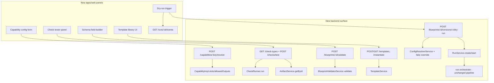

# Phase 9 — Editor & Templates

Status: implementation plan
Baseline: `main` at `cbedbc7` (Phase 8 merged)
Scope: capability-resolved config forms, a script-check tester, the template
library (save/list/instantiate for all four `template.kind` values), and
dry-run execution against `FakeProviderAdapter`. Frontend scope is the
non-canvas panels only — a drag/drop visual stage-graph editor is explicitly
deferred to a later phase (see Locked Decision 5).

## Outcome

At the end of this phase: `POST /capabilities/:key/resolve` lets an editor
build a live config form for any capability and see its resulting
`slots`/`allowedOutputs` before saving a stage. `GET /check-types` +
`POST /checks/test` let an author pick a builtin (or write a script check) and
test it against a real artifact from a past run before wiring it into a
blueprint. `POST /blueprints/:id/validate` gives instant feedback on a draft
graph with no persistence. The template library (`GET/POST /templates`,
`GET /templates/:id/versions`, `POST /templates/:id/instantiate`) supports all
four `template.kind` values (`blueprint`/`schema`/`check`/`stage`), including
saving the user's own templates alongside the builtin-seeded ones.
`POST /blueprints/:id/versions/:v/dry-run` runs a real (but fake-provider-only,
near-zero-cost) run through the actual async orchestration pipeline, so
"does this graph actually execute" is answered by the real engine, not a
simulation of it. `apps/web` gains focused panels for each of these — no
visual graph canvas yet; the graph itself stays JSON-authored.

## Locked product decisions

Resolved with the user before implementation begins, mirroring how Phase 7/8
walked their open decisions:

1. **Dry-run creates a real `run` row and reuses the existing async Inngest
   orchestration**, tagged so it's distinguishable from a normal run. Every
   stage's model pin is overridden to the fake provider regardless of what
   the graph authors. The caller observes it exactly like a real run — poll
   `GET /runs/:id` or subscribe to `GET /runs/:id/events` (SSE). No bespoke
   synchronous execution path is built. Consequence accepted explicitly:
   dry-runs write real (near-zero-cost) ledger rows and must be filterable
   out of "real work" run listings.
2. **`POST /templates/:id/instantiate` on a `schema`/`check`/`stage`-kind
   template returns the inlined body only** (`{ body }`) — it does not write
   anything to the database and does not accept a splice target. The calling
   editor is responsible for placing the copied fragment into whatever it is
   currently editing and saving that itself via the normal blueprint-save
   path. Only `kind: 'blueprint'` instantiation creates a new
   `blueprint_version`, unchanged from today.
3. **The visual stage-graph canvas editor is out of scope for this phase.**
   Phase 9 delivers the backend endpoints plus focused frontend panels
   (capability config form, schema field-builder, check tester, template
   library browser/save dialog, dry-run trigger); the blueprint graph itself
   continues to be authored as structured JSON. A canvas editor, if wanted,
   is a follow-up phase built on top of these APIs.
4. **The 9 builtin checks' `params` gain a hand-authored parallel
   `paramsSchema: JsonSchema` field**, kept in sync by hand with the existing
   `params: ZodType` — no new dependency (`zod-to-json-schema` or similar) is
   introduced. A test asserts a fixture set validates against both schemas so
   the two can't silently diverge.
5. **`POST /capabilities/:key/resolve` and `POST /blueprints/:id/validate`
   are pure extensions of existing logic, not new engine surface.** `resolve`
   is controller glue over `CapabilityImpl.slots()`/`.allowedOutputs()`
   (already functions of config on every impl); `validate` is
   `BlueprintValidatorService.validate()` reused via a pre-persist extraction
   out of `BlueprintService.createVersion()`. Neither needed new validator or
   capability-interface methods — confirmed during design research, not
   assumed.
6. **`POST /templates` (saving a user template) validates per-`kind`, scoped
   to what a template — not yet placed in a channel or a graph — can actually
   check**: `blueprint` runs `BlueprintValidatorService.validate()` in a
   channel-agnostic mode (empty asset/character maps; `{from:'asset'}`/
   `{from:'role'}` refs surface as expected "unknown" warnings, not save
   blockers); `schema` runs the existing dialect/compile checks; `check`
   reuses the exact per-check validation `BlueprintValidatorService` already
   runs inline (factored out into a shared function); `stage` checks
   capability existence, config-vs-configSchema, and output-kind-vs-
   allowedOutputs only (no ref/binding checks — a template stage has no graph
   context yet). `templateVersion.requires.capabilities` is derived
   automatically from the graph's/stage's own `capability` field(s) at save
   time for `blueprint` and `stage` kinds, not trusted as hand-authored input.

## Current baseline — what already exists vs. what this phase adds

Confirmed by direct reading during design research, not assumed:

| Area                                                                     | State                                                                                                                                                                                                                                                                                                                                                                                 |
| ------------------------------------------------------------------------ | ------------------------------------------------------------------------------------------------------------------------------------------------------------------------------------------------------------------------------------------------------------------------------------------------------------------------------------------------------------------------------------- |
| `CapabilityImpl.slots(cfg)` / `.allowedOutputs(cfg)`                     | Already implemented on every capability, already functions of config (e.g. `MediaAnalyzeCapability` branches on `cfg.operation`). Nothing to add here beyond the endpoint.                                                                                                                                                                                                            |
| `SchemaValidatorService.validate/checkDialect/checkCompilable`           | Already implemented and used internally by the validator. Reusable as-is for `resolve`'s config check and for schema-kind template validation.                                                                                                                                                                                                                                        |
| `GET /capabilities`, `GET /styles`, `GET /providers/:id/models`          | Already implemented (`capability.controller.ts`). **Missing**: `POST /capabilities/:key/resolve`.                                                                                                                                                                                                                                                                                     |
| `BuiltinCheck.params` (9 builtins)                                       | Zod-only today. **Missing**: parallel `paramsSchema: JsonSchema` field (Locked Decision 4), and any `GET /check-types` endpoint.                                                                                                                                                                                                                                                      |
| `CheckRunner.run()`                                                      | Already pure/DB-free, already takes pre-resolved refs. **Missing**: any controller wrapping it, and `ArtifactService.getById()` to look up an artifact for `POST /checks/test`.                                                                                                                                                                                                       |
| `BlueprintValidatorService.validate()`                                   | Already pure and DB-free, already decoupled from persistence. **Missing**: an entrypoint that stops short of the `db.transaction` insert `BlueprintService.createVersion()` currently always does.                                                                                                                                                                                    |
| `BlueprintController`                                                    | Has `POST/GET :id/versions` only. **Missing**: `POST :id/validate`, `POST :id/versions/:v/dry-run`.                                                                                                                                                                                                                                                                                   |
| `template`/`template_version` tables                                     | Already match the spec exactly — **no migration needed** for the base schema.                                                                                                                                                                                                                                                                                                         |
| `TemplateController`/`TemplateService`                                   | `GET /templates` returns builtin-only (`listBuiltin()`), never the caller's own `source: 'user'` rows. `instantiate()` is hardcoded to `StageDef[]` bodies and always calls `BlueprintService.createVersion()` — only sensible for `kind: 'blueprint'`. **Missing**: `POST /templates`, `GET /templates/:id/versions`, non-blueprint-kind instantiate handling, `requires` surfacing. |
| `FakeProviderAdapter`                                                    | Already mature — scripted latency, deterministic near-zero cost, injectable failures, selected via `provider: 'fake'` model pins. Nothing to add to the adapter itself.                                                                                                                                                                                                               |
| Async run pipeline (`RunService`, `run.orchestrate`, Inngest steps, SSE) | Already the only execution path; fully durable/async by construction. **Missing**: any "force every stage onto fake" override layer, any `run.dryRun`/`kind` column, the dry-run endpoint itself.                                                                                                                                                                                     |
| `ConfigResolverService.resolveRunConfig()`                               | Already merges `engine → channel → blueprint → stageDefLayer`. **Missing**: a post-merge "force fake provider" override step, and a modality→fake-model lookup.                                                                                                                                                                                                                       |
| `apps/web`                                                               | Real React app (router, react-query, remotion player) with `BlueprintsPage`/`ChannelsPage`/`RunPage`/`TimelineEditorPage`. No blueprint graph editor of any kind exists — blueprints are authored as raw `CreateBlueprintVersionDto` JSON today. **Missing**: every panel this phase adds (capability form, schema editor, check tester, template library UI, dry-run trigger).       |

This means, like Phase 7, the phase is mostly _wiring_, not new architecture —
the riskiest genuinely new piece is the dry-run execution path (Chunk 5),
everything else is extraction/exposure of logic that already exists.

## Cross-cutting architecture

---

## Chunk 1 — Capability resolve + check-types plumbing

### Goal

Land the smallest, most self-contained backend surface first: a way for an
editor to ask "given this capability and this partial config, what are my
slots and allowed outputs" and a way to list builtin check types with a
JSON-Schema-describable params shape.

### Implementation

1. **`packages/shared/src/dto/capability.dto.ts`** — add
   `ResolveCapabilityRequestDto` (`{ config: Record<string, unknown> }`) and a
   response shape `{ slots: Record<string, SlotDef>, allowedOutputs:
OutputKind[] }` (types only; no runtime validation needed on the response
   side).
2. **`apps/api/src/capability/capability.controller.ts`** — add
   `POST capabilities/:key/resolve`: look up the impl via
   `CapabilityRegistry.get(key)` (404 if missing), validate `body.config`
   against `impl.configSchema` via `SchemaValidatorService.validate()`
   (return the violations as a 400-shaped error if invalid — a resolve call
   is expected to arrive with a schema-shaped config even if semantically
   incomplete), then return `{ slots: impl.slots(body.config), allowedOutputs:
impl.allowedOutputs(body.config) }`.
3. **`apps/api/src/check/check.types.ts`** — extend `BuiltinCheck` with
   `paramsSchema: JsonSchema` alongside the existing `params: ZodType`.
4. **Each of the 9 files under `apps/api/src/check/builtins/`** — add the
   hand-authored `paramsSchema` matching its existing `params` Zod shape
   (`word-count.ts`, `wpm.ts`, `duration-range.ts`, `regex-match.ts`,
   `regex-absent.ts`, `numeric-range.ts`, `array-length.ts`,
   `media-format.ts`, `non-empty.ts`).
5. **New `apps/api/src/check/check.controller.ts`** — `GET check-types`
   returning `BUILTIN_CHECKS.map(c => ({ key: c.key, kind: 'builtin' as const,
paramsSchema: c.paramsSchema, description: c.description }))` plus one
   static entry describing the `script` check shape (`{ key: 'script', kind:
'script', description: '...' }` — no params schema, since a script check's
   shape is `{code, refs}`, not builtin params). Register the controller in
   `CheckModule`.

### Primary files

- `packages/shared/src/dto/capability.dto.ts`
- `apps/api/src/capability/capability.controller.ts`
- `apps/api/src/check/check.types.ts`
- `apps/api/src/check/builtins/*.ts` (all 9)
- new `apps/api/src/check/check.controller.ts`
- `apps/api/src/check/check.module.ts`

### Tests and exit criteria

- Unit tests per capability impl: `resolve`-equivalent call against a couple
  of representative configs (including a config-conditional one, e.g.
  `media.analyze`'s `operation` branch) returns the same `slots`/
  `allowedOutputs` the impl's own methods would.
- A schema-invalid config passed to `resolve` returns violations, not a
  crash from `slots()`/`allowedOutputs()` being called on bad input.
- A test asserting every `BUILTIN_CHECKS` entry's `paramsSchema` accepts a
  small fixture set that its `params: ZodType` also accepts (the drift guard
  from Locked Decision 4).
- `GET /check-types` returns all 9 builtins + the `script` entry.
- `pnpm --filter @reelcraft/api typecheck`, `pnpm lint`.

---

## Chunk 2 — `POST /checks/test`

### Goal

Let an author test a builtin or script check against a real artifact from a
past run, before wiring it into a blueprint's `checks[]`.

### Implementation

1. **`apps/api/src/artifact/artifact.service.ts`** — add `getById(artifactId):
Promise<{kind, data, probe, runId, producerStageKey, itemIndex}>` (404 if
   missing/collected).
2. **New `apps/api/src/check/check-test.service.ts`** — `test(check: CheckDef,
artifactId: string): Promise<CheckResult>`:
   - loads the artifact via `ArtifactService.getById()`;
   - if the check is a script check with `refs`, builds the `BindingScope`
     needed to resolve them: loads the artifact's run, the run's blueprint
     version graph (to find `prevStageKey` relative to the artifact's
     `producerStageKey`), and the run's stored `inputs`/asset/role bindings —
     then calls `BindingResolverService.resolveRefEnvelopes(check.refs
?? [], scope)`;
   - calls `CheckRunner.run({ checks: [check], resolvedRefs: [...],
artifact: {...}, outputSchema: undefined })` and returns the single
     `CheckResult`.
3. **`packages/shared/src/dto/check.dto.ts`** (new) — `TestCheckRequestDto`
   (`{ check: CheckDef, artifactId: string }`).
4. **`apps/api/src/check/check.controller.ts`** — add `POST checks/test`.

### Primary files

- `apps/api/src/artifact/artifact.service.ts`
- new `apps/api/src/check/check-test.service.ts`
- new `packages/shared/src/dto/check.dto.ts`
- `apps/api/src/check/check.controller.ts`, `check.module.ts`

### Tests and exit criteria

- A builtin check (e.g. `word-count`) tested against a fixture artifact
  returns the expected pass/fail.
- A script check with `refs` resolves against a real seeded run + artifact
  (integration-style — this is the riskiest part of the chunk, since
  `BindingScope` construction from just an `artifactId` is new plumbing).
- Authoring-fault cases: unknown builtin key, a script that doesn't compile —
  both return `fault: 'authoring'` results, not a 500.
- `pnpm test`, `pnpm --filter @reelcraft/api typecheck`.

---

## Chunk 3 — `POST /blueprints/:id/validate`

### Goal

Give the editor instant, no-persistence validation feedback on a draft graph.

### Implementation

1. **`apps/api/src/blueprint/blueprint.service.ts`** — extract the pre-persist
   half of `createVersion()` (load blueprint row for `channelId`,
   `loadAssetsById`, `loadCharactersById`, `validator.validate(...)`,
   `validateReferenceLimits(...)`) into a private `computeValidation(
blueprintId, dto): Promise<{issues: ValidationIssue[]; runnable: boolean}>`.
   `createVersion()` calls it, then persists as before (behavior-identical,
   zero duplicated logic). Add `validateOnly(blueprintId, dto)` that calls
   `computeValidation` and returns its result without writing anything.
2. **`apps/api/src/blueprint/blueprint.controller.ts`** — add
   `POST :id/validate` accepting the same `CreateBlueprintVersionDto` shape,
   calling `validateOnly`.

### Primary files

- `apps/api/src/blueprint/blueprint.service.ts`
- `apps/api/src/blueprint/blueprint.controller.ts`

### Tests and exit criteria

- `validateOnly` returns identical `issues`/`runnable` to what `createVersion`
  would compute for the same input.
- Calling `POST :id/validate` writes zero `blueprint_version` rows (row count
  unchanged before/after, asserted directly against the DB).
- Existing `createVersion` behavior/tests unchanged (regression guard on the
  refactor).
- `pnpm test`, `pnpm --filter @reelcraft/api typecheck`.

---

## Chunk 4 — Template library completion

### Goal

Make the template library actually a library: user templates alongside
builtins, save validation per kind, version history, and non-blueprint
instantiate support.

### Implementation

1. **`apps/api/src/template/template.service.ts` — `list()`** (replaces
   `listBuiltin()` as the method the controller calls): `source = 'builtin'
OR (source = 'user' AND ownerId = @Owner())`.
2. **`packages/shared/src/dto/template.dto.ts`** (new) — `SaveTemplateDto`
   (`{ kind, name, description, tags, body, requires? }`).
3. **`TemplateService.save(dto, ownerId)`** — per-`kind` validation (Locked
   Decision 6):
   - `blueprint`: `BlueprintValidatorService.validate()` with empty
     `assetsById`/`charactersById` maps (channel-agnostic mode); derive
     `requires.capabilities` from the graph's own `stage.capability` values.
   - `schema`: `SchemaValidatorService.checkDialect()` +
     `.checkCompilable()`.
   - `check`: factor the existing per-check validation block out of
     `BlueprintValidatorService.validateStage`'s check loop into a standalone
     `validateCheckDef(check)` function both call; use it here.
   - `stage`: capability exists, `config` matches `configSchema` (via
     `SchemaValidatorService.validate`), `output.kind` is in
     `impl.allowedOutputs(config)`; derive `requires.capabilities` from the
     stage's own `capability`.
   - Reject on `(ownerId, kind, name)` collision with a clear message, not a
     raw unique-constraint error.
   - Insert `template` + first `template_version` row inside a transaction.
4. **`TemplateService.listVersions(templateId)`** — all versions, newest
   first.
5. **`TemplateService.instantiate()`** — branch on `kind`:
   - `blueprint`: unchanged existing behavior (regression guard).
   - `schema`/`check`/`stage`: return `{ body: latest.body }` directly, no DB
     write (Locked Decision 2).
   - All kinds: response also includes `requires` so the caller can warn
     before acting on it.
6. **`apps/api/src/template/template.controller.ts`** — wire `POST templates`
   (save), `GET templates/:id/versions`, update `GET templates` and
   `POST templates/:id/instantiate` for the above.

### Primary files

- `apps/api/src/template/template.service.ts`
- `apps/api/src/template/template.controller.ts`
- new `packages/shared/src/dto/template.dto.ts`
- `apps/api/src/blueprint/blueprint-validator.service.ts` (factor out
  `validateCheckDef` for reuse — no behavior change to existing call site)

### Tests and exit criteria

- Round-trip save → list → instantiate for each of the 4 kinds.
- A save that fails per-kind validation is rejected with a useful
  path/message, not a generic 500.
- `GET /templates` returns builtin + the caller's own user templates.
- `instantiate` on a `blueprint`-kind template behaves exactly as before
  (regression guard against the existing seeded `HELLO_STAGE_GRAPH` template).
- `instantiate` on `schema`/`check`/`stage` kinds returns `{body, requires}`
  and writes nothing.
- Name collision within the same owner+kind is rejected cleanly.
- `pnpm test`, `pnpm --filter @reelcraft/api typecheck`.

---

## Chunk 5 — Dry-run execution

### Goal

Land `POST /blueprints/:id/versions/:v/dry-run`: a real run, forced onto the
fake provider, through the real async pipeline.

### Implementation

1. **`apps/api/src/db/schema/run.ts`** — add `dryRun: boolean().notNull()
.default(false)`. New migration + snapshot (the only migration in this
   phase).
2. **`apps/api/src/run-config/config-resolver.service.ts`** — after
   `resolveRunConfig()`'s normal merge, when `dryRun` is set, apply a
   per-stage override: `model.provider = 'fake'`, `model.modelId` chosen from
   a small modality→fake-model lookup (`fake-text-1`/`fake-image-1`/
   `fake-video-1`/`fake-audio-1`) keyed by the stage's capability's
   `modality`. Same override applies to a stage's `qc.judge` model pin if
   present.
3. **`apps/api/src/run/run.service.ts`** — `assertTextStagesHaveMaxTokens`
   (or its caller) skips/relaxes for `dryRun` runs — a draft graph being
   dry-run specifically to find problems shouldn't be blocked by a
   real-spend guard that doesn't apply once every stage is forced fake.
4. **New method (on `RunService` or a small `DryRunService` composing it)** —
   `startDryRun(blueprintId, version)`: loads the version's graph, resolves
   config with the fake override applied, creates a `run` row with
   `dryRun: true` and a small fixed `budgetCapUsd` (e.g. `$1`), calls the
   existing `start()` path, returns the run id.
5. **`apps/api/src/blueprint/blueprint.controller.ts`** — add
   `POST :id/versions/:v/dry-run`.
6. **`apps/api/src/run/run.controller.ts`** — `GET /runs` gains a filter (or
   defaults to excluding `dryRun: true`) so dry-runs don't pollute the normal
   run list; confirm any spend-aggregation query elsewhere excludes
   `dryRun: true` rows too (audit, not necessarily new code).

### Primary files

- `apps/api/src/db/schema/run.ts` + new migration/snapshot
- `apps/api/src/run-config/config-resolver.service.ts`
- `apps/api/src/run/run.service.ts`
- `apps/api/src/run/run.controller.ts`
- `apps/api/src/blueprint/blueprint.controller.ts`

### Tests and exit criteria

- A dry-run against a multi-stage graph (text + media stage) settles `DONE`,
  every stage attempt used `provider: 'fake'` regardless of the graph's
  authored real-provider pins, total ledger spend matches the fake adapter's
  deterministic near-zero cost.
- `GET /runs` excludes dry-runs by default; an explicit filter can include
  them.
- A graph missing `max_tokens` on a text stage still dry-runs successfully
  (the real-spend guard doesn't block it).
- `pnpm test`, `pnpm --filter @reelcraft/api typecheck`, migration applies
  cleanly against a database at the current head.

---

## Chunk 6 — Frontend: capability config form + schema editor panel

### Goal

Ship the first two editor panels, reusable across later chunks.

### Implementation

1. **`apps/web/src/api/client.ts`** — add calls for `resolveCapability`,
   `validateBlueprint`.
2. **New `apps/web/src/components/CapabilityConfigForm.tsx`** — given a
   capability key + a config object, renders a form driven by
   `GET /capabilities` (for `configSchema`) and calls
   `/capabilities/:key/resolve` on change to show live `slots`/
   `allowedOutputs`.
3. **New `apps/web/src/components/SchemaEditor.tsx`** — a JSON-schema
   field-builder for `output.schema`/`InputDef.accepts.schema` and
   `schema`-kind template bodies; surfaces dialect/compile errors from
   `POST /blueprints/:id/validate` (no standalone schema-validate endpoint
   exists, per the gap inventory — validation feedback comes from the
   blueprint-validate call in context, or a lightweight local Ajv-strict
   compile check reusing the same restricted-dialect rules client-side if
   that proves friction-heavy in practice).

### Primary files

- `apps/web/src/api/client.ts`
- new `apps/web/src/components/CapabilityConfigForm.tsx`
- new `apps/web/src/components/SchemaEditor.tsx`

### Tests and exit criteria

- Manual verification in the browser: pick a capability, edit its config,
  see `slots`/`allowedOutputs` update live; edit a schema, see dialect/
  compile errors surface.
- `pnpm --filter @reelcraft/web typecheck`, `pnpm --filter @reelcraft/web
build`.

---

## Chunk 7 — Frontend: check tester, template library, dry-run trigger

### Goal

Ship the remaining panels and wire them into the existing pages.

### Implementation

1. **`apps/web/src/api/client.ts`** — add calls for `listCheckTypes`,
   `testCheck`, `listTemplates`, `saveTemplate`, `listTemplateVersions`,
   `instantiateTemplate`, `startDryRun`.
2. **New check-tester panel** — builtin picker (from `GET /check-types`) +
   generated params form, or a script editor; an artifact picker (by run);
   "test" button hitting `POST /checks/test`, rendering the `CheckResult`.
3. **Extend `apps/web/src/pages/BlueprintsPage.tsx`** (or a new
   `TemplateLibraryPage.tsx`) — list/save/instantiate across all 4 template
   kinds, surfacing `requires` as a warning before instantiating.
4. **Dry-run trigger** — a button on the blueprint version view that POSTs to
   the dry-run endpoint and routes to `RunPage.tsx`'s existing SSE-consuming
   view, exactly like a real run.
5. **`apps/web/src/App.tsx`** — router additions as needed for any new page.

### Primary files

- `apps/web/src/api/client.ts`
- new check-tester panel/page
- `apps/web/src/pages/BlueprintsPage.tsx` or new `TemplateLibraryPage.tsx`
- `apps/web/src/App.tsx`

### Tests and exit criteria

- Manual acceptance path: save a `check`-kind template → instantiate it (get
  the body back) → test it via the check-tester panel against a real
  artifact → save/instantiate a `blueprint`-kind template → dry-run it →
  watch it complete via the existing SSE run view.
- `pnpm --filter @reelcraft/web typecheck`, `pnpm --filter @reelcraft/web
build`.

---

## Risks (carried into implementation, not re-litigated per chunk)

1. **Ledger/spend reporting must exclude dry-runs.** `run.dryRun` makes this
   filterable, but every existing spend-aggregation query needs an explicit
   check during Chunk 5, not just the run-listing endpoint.
2. **Pre-flight assertions written for real runs may over-block dry-runs.**
   `assertTextStagesHaveMaxTokens` is the one confirmed case; watch for
   others surfacing during Chunk 5's implementation and testing.
3. **The hand-kept `paramsSchema`/`params` pair (Locked Decision 4) has no
   compiler enforcement.** The fixture-based drift test in Chunk 1 is the
   only guard — keep it meaningful, not a rubber stamp.
4. **Channel-agnostic template validation (Locked Decision 6) is inherently
   partial.** A `blueprint`-kind template that validates cleanly at save time
   can still fail on instantiation into a channel lacking the referenced
   capabilities/assets — this is expected (it's exactly why `requires`
   exists), not a bug to chase.
