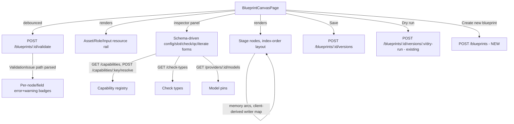

# Phase 9.5 — Visual Blueprint Canvas

Status: implementation plan
Baseline: `main` at `acedf43` (Phase 9 merged, PR #19)
Scope: a no-code, drag/drop visual editor for authoring a blueprint's stage
graph — the single product surface non-programmers use to build a blueprint
from scratch, edit an existing one, and see live validation, with **no raw
JSON graph-authoring surface anywhere in the product**. Not in the original
design spec (§24's Build Order stops at Phase 9); split out of Phase 9 by
explicit product decision (`docs/build-progress.md`'s Phase 9.5 row) and
scoped further by direct user decisions during this planning pass (see
Locked Decisions 2–3).

## Outcome

At the end of this phase, a user with no programming background can: create
a new blueprint, add stages one at a time by picking a capability from a
list, configure each stage's settings through generated forms (never JSON),
wire each stage's inputs to the previous stage's output, a Run Memory key,
a channel asset, a role, a declared run input, the current iteration item,
or a literal value — all through pickers, never by typing a `Ref` object —
attach checks (builtin, picked from a list and configured through a form; or
script, with a plain JavaScript code field), see live validation errors
surfaced on the exact node/field they're about, save the blueprint, and
trigger a dry run — entirely from one canvas page, never leaving it to edit
raw text. The blueprint graph the canvas produces is byte-identical
`StageDef[]` JSON to what Phase 9's JSON-based tooling already understands
(`POST /blueprints/:id/validate`, `POST /blueprints/:id/versions`,
`POST /blueprints/:id/versions/:v/dry-run`) — this phase adds a UI in front
of those APIs, not a new data model.

## Locked product decisions

Resolved with the user before implementation begins:

1. **Adopt `@xyflow/react` (React Flow) for the canvas itself** — the first
   new frontend dependency added in this project's history (Phases 6–9
   added zero). Justified because hand-rolling drag physics, edge routing,
   and zoom/pan is exactly the kind of multi-week sink a library exists to
   avoid, and the "no new dependencies" streak was a byproduct of every
   prior phase being pure CRUD/forms, not a deliberate policy. Node layout
   stays simple (Locked Decision 5) — the library is for interaction, not
   auto-layout.
2. **Full round-trip editing ships in this phase**, not staged behind a
   read-only-first release: add/remove/reorder stages, rewire bindings,
   configure every field, save, and dry-run all land together. (The
   originally recommended "read-only first" staging was explicitly
   overridden by the user.)
3. **No-code mandate, no exceptions but one.** Every `StageDef` field —
   including the ones a "canvas" doesn't obviously cover (script checks,
   `iterate`/`alignWith`, `approval.onReject` routing, raw model-pin
   params, QC criteria/dimensions, `enabledWhen`) — gets real form/picker
   UI. There is no JSON textarea anywhere in this product for authoring a
   blueprint graph or any of its stages, checks, or schemas. **The sole
   carve-out, explicit from the user**: a script check's `code` field is a
   plain JavaScript code textarea (script code is inherently code, not
   config) — an LLM-assisted "generate this script" button is a real,
   named idea but is explicitly deferred out of this phase's scope, not
   built now.
4. **`Ref` → visual element mapping** (the data-model translation this
   whole phase hinges on, per §6.1's "a stage binds only the immediately
   preceding stage — there is no `{from:'stage', stageKey}` variant, this
   is the v6 decision, not an omission"):
   - `{from:'prev'}` (incl. `alignWith:'item'`) → a **real edge** from the
     literal previous node. `alignWith:'item'` renders as a visually
     distinct edge style (it carries the extra cross-stage
     iterate-arity-match invariant `checkAlignWith` enforces).
   - `{from:'memory', key}` → a **computed edge** (an arc, not a straight
     line — see Decision 5) from whichever earlier stage(s) declare
     `writes[key]`. Zero writers is a validator error (surfaced per Locked
     Decision 6, not re-derived); multiple writers renders the arc from
     all of them with a warning badge (mirrors `checkMemoryWrittenByMultiple`).
   - `{from:'asset'}` / `{from:'role'}` / `{from:'input'}` → an edge from a
     **non-node resource anchor** (a small fixed rail of channel-asset /
     role / declared-input chips beside the canvas), never from a stage.
   - `{from:'const'}` / `{from:'item'}` / `{from:'prevItem'}` → **never an
     edge** — an inline annotation on the node's own slot/context row
     (`const`: the literal value shown inline; `item`/`prevItem`: a small
     "← item" / "← prevItem" badge, since both refer to the stage's own
     iteration state, not another node).
5. **Fixed sequential trunk layout, no auto-layout engine.** Per §3.5
   ("nothing runs in parallel" — stages execute in one fixed order), the
   graph's "trunk" is always a straight line: node x-position = array
   index (fixed spacing), never a persisted or user-draggable coordinate.
   Only `memory` edges need special routing (drawn as arcs spanning
   multiple node-widths when non-adjacent); no `dagre`/`elkjs`-style
   generic DAG layout is needed or added, even though `@xyflow/react`
   supports one. Nodes ARE draggable for reordering (Locked Decision 2),
   but a drop always snaps back onto the trunk at the nearest index — free
   2D positioning is not a feature.
6. **Memory-writer lookup (which stage's `writes` produced a given key) is
   derived client-side**, not exposed via a new API field. The scan is
   ~10 lines (`for stage of graph: for key in stage.writes ?? {}: record
{stageKey, key}`) and needs nothing `BlueprintValidatorService` doesn't
   already have available to the client in the draft graph itself. This is
   strictly for **drawing edges** — the client never re-derives whether a
   binding is _valid_; that stays exclusively server-authoritative via
   `POST /blueprints/:id/validate`, rendered through Locked Decision 8's
   path-parser, never re-decided client-side.
7. **Two small, additive backend endpoints, wrapping existing service
   logic with zero new business logic**:
   - `POST /blueprints` (`{channelId, name}` → `BlueprintService.ensureBlueprint`)
     — confirmed missing: today the only way a `blueprint` row is ever
     created is `TemplateService.instantiate()`'s internal call to
     `ensureBlueprint`, with no endpoint for a user to start a _blank_
     blueprint without going through a template first. `ensureBlueprint`
     itself needs no changes — it's already idempotent by
     `(channelId, name)`.
   - No other backend change. `POST /blueprints/:id/versions`,
     `POST /blueprints/:id/validate`, `POST /blueprints/:id/versions/:v/dry-run`,
     `GET /capabilities`, `POST /capabilities/:key/resolve`,
     `GET /check-types`, `GET /providers/:id/models` are all already fully
     implemented by Phase 9 and untouched here.
8. **`ValidationIssue.path` → node/field mapping via one shared parser.** A
   `parseValidationPath()` utility (new, small, unit-tested against every
   path shape the validator actually emits — see the baseline table) maps
   a dotted path like `stages.myStage.slots.foo` to `{stageKey: 'myStage',
region: 'slots', name: 'foo'}`, so the canvas can highlight the exact
   node and field an issue is about. Paths that don't name a stage
   (`memory.<key>`, `roles.<key>`, the bare `graph`) render as graph-level
   or resource-anchor-level banners instead of being forced onto a node.

## Current baseline — what already exists vs. what this phase adds

Confirmed by direct reading during design research, not assumed:

| Area                                                                                                    | State                                                                                                                                                                                                                                                                                                                                                                                                                                                                                                                                                                                                                                                                                                                                                                                                                                                                            |
| ------------------------------------------------------------------------------------------------------- | -------------------------------------------------------------------------------------------------------------------------------------------------------------------------------------------------------------------------------------------------------------------------------------------------------------------------------------------------------------------------------------------------------------------------------------------------------------------------------------------------------------------------------------------------------------------------------------------------------------------------------------------------------------------------------------------------------------------------------------------------------------------------------------------------------------------------------------------------------------------------------- |
| `StageDef`/`Ref`/`OutputDef`/`QcDef` (`packages/shared/src/`)                                           | Fully defined, stable, unchanged by this phase — the canvas produces exactly this shape. `Ref` has exactly 8 variants (see Locked Decision 4). Restricted `JsonSchema` (§4.2) is a small closed set of 6 `type`s with `enum`/`required`/`items`/min-max constraints — no `$ref`/`oneOf`/`patternProperties` — bounded enough to build a real visual schema builder against.                                                                                                                                                                                                                                                                                                                                                                                                                                                                                                      |
| `POST /capabilities/:key/resolve`, `GET /capabilities`, `GET /check-types`, `GET /providers/:id/models` | Fully implemented (Phase 9 Chunk 1). Reused as-is for capability pickers, config-schema-driven forms, check-type pickers, and model-pin pickers.                                                                                                                                                                                                                                                                                                                                                                                                                                                                                                                                                                                                                                                                                                                                 |
| `POST /blueprints/:id/validate`                                                                         | Fully implemented (Phase 9 Chunk 3). Returns `{issues: ValidationIssue[], runnable}`. `issues[].path` follows a small stable set of dotted shapes (`stages.<key>`, `stages.<key>.slots.<name>`, `stages.<key>.context.<name>`, `stages.<key>.config...`, `stages.<key>.checks[<i>].refs.<name>`, `stages.<key>.iterate.over`, `stages.<key>.approval.onReject.retryStageKey`, `stages.<key>.instructions.template`, `memory.<key>`, `roles.<key>`, `roles.<key>.referenceBlobIds`, `inputs.<key>.schema`, bare `graph`) — confirmed by reading `blueprint-validator.service.ts` directly, not guessed.                                                                                                                                                                                                                                                                           |
| `POST /blueprints/:id/versions` (`BlueprintService.createVersion`)                                      | Fully implemented. Takes `CreateBlueprintVersionDto` (`graph, inputs, roles, defaults, budget`). **Missing client wrapper** — `apps/web/src/api/client.ts` has no function calling this endpoint at all.                                                                                                                                                                                                                                                                                                                                                                                                                                                                                                                                                                                                                                                                         |
| `POST /blueprints/:id/versions/:v/dry-run`                                                              | Fully implemented (Phase 9 Chunk 5), already wrapped client-side as `api.startDryRun` and used by `DryRunTrigger.tsx`.                                                                                                                                                                                                                                                                                                                                                                                                                                                                                                                                                                                                                                                                                                                                                           |
| `POST /blueprints` (create a bare blueprint)                                                            | **Does not exist.** `BlueprintController` only has routes under an existing `:id` plus `:id/versions`/`:id/validate`/`:id/versions/:v/dry-run`. `BlueprintService.ensureBlueprint(channelId, name)` is public and idempotent but has no controller route calling it directly — only reachable today via `TemplateService.instantiate()`. **Net new** (Locked Decision 7).                                                                                                                                                                                                                                                                                                                                                                                                                                                                                                        |
| `apps/web` frontend                                                                                     | Real React app, no UI kit, no global state library, `@tanstack/react-query` for all data fetching. **No graph/canvas/diagramming/drag-and-drop library exists anywhere** (confirmed: `package.json` + full `pnpm-lock.yaml` grep for `reactflow`/`@xyflow/react`/`konva`/`d3`/`dagre`/`react-dnd`/`@dnd-kit` all return zero; grep for `dnd\|draggable\|onDragStart\|onDrop` across `apps/web/src` returns zero). `TimelineEditorPage.tsx` (Phase 6) is the most complex existing page — a useful precedent for **state management** (bounded undo/redo via `structuredClone` snapshots, debounced autosave with server-revision conflict detection, click-to-select + inspector-panel editing, layout recomputed from data on every render rather than persisted) but **not** a drag-and-drop precedent — it has none; clip positioning is CSS math, editing is numeric inputs. |
| A page for authoring a full `StageDef[]` graph (JSON or otherwise)                                      | **Does not exist.** Phase 9 built per-capability config forms (`CapabilityConfigForm`), a standalone schema editor (`SchemaEditor`), a check tester (`CheckTesterPage`), and a template-instantiate flow (`TemplateLibraryPanel`) — none of these let a user compose a full stage graph from scratch. This phase's Chunk 1 is the first time such a page exists at all, and per Locked Decision 3 it is the canvas from day one, never a JSON intermediate.                                                                                                                                                                                                                                                                                                                                                                                                                      |

This means, unlike every prior phase, this one is **almost entirely new
frontend surface** — the backend is one small additive endpoint (Locked
Decision 7) plus zero other changes; everything else is UI built on top of
Phase 9's already-complete API surface.

## Cross-cutting architecture

---

## Chunk 1 — Backend baseline + canvas skeleton

### Goal

Land the one net-new backend endpoint, the missing client wrappers, the
`@xyflow/react` dependency, and an empty canvas page that renders a
`StageDef[]` draft held in local state — no editing yet, just the
skeleton every later chunk builds on.

### Implementation

1. **`apps/api/src/blueprint/blueprint.controller.ts`** — add
   `POST blueprints` (`{channelId, name}` → `ensureBlueprint`, returning
   `{blueprintId}`). New `packages/shared/src/dto/blueprint.dto.ts` entry
   `CreateBlueprintDto` (`{channelId: z.string(), name: z.string().min(1)}`),
   `ZodValidationPipe`-wired, matching every other new endpoint's
   convention from Phase 9's post-review fixes.
2. **`apps/web/package.json`** — add `@xyflow/react` (check its current
   published major version and peer-dep requirements against this repo's
   React 18.3 before pinning).
3. **`apps/web/src/api/client.ts`** — add `createBlueprint`,
   `createBlueprintVersion`, `validateBlueprint` wrappers (none exist
   today), typed against `CreateBlueprintDto`/`CreateBlueprintVersionDto`/
   the validate response shape from `@reelcraft/shared`.
4. **New `apps/web/src/pages/BlueprintCanvasPage.tsx`** — routed at (e.g.)
   `/channels/:channelId/build` (new blueprint) and
   `/blueprints/:blueprintId/build` (edit existing, loading its latest
   version's `graph` into local state via a new `getBlueprintVersion`-style
   read — check whether `GET /blueprints/:id/versions` already gives
   enough to seed a draft, or whether it needs the specific latest version;
   this endpoint exists per the baseline table). Holds the draft
   `StageDef[]` (plus `inputs`/`roles`/`defaults`/`budget`) as local
   `useState`, renders an empty `@xyflow/react` canvas with an "Add your
   first stage" empty state. `apps/web/src/App.tsx` gains the new
   route(s); `BlueprintsPage.tsx` gains a "Create custom blueprint" entry
   point into it.
5. **`apps/web/src/components/canvas/` (new directory)** — establish the
   file organization for the rest of this phase's components
   (`StageNode.tsx`, `BindingPicker.tsx`, `SchemaBuilder.tsx`, etc. land in
   later chunks).

### Primary files

- `apps/api/src/blueprint/blueprint.controller.ts`
- `packages/shared/src/dto/blueprint.dto.ts`
- `apps/web/package.json`
- `apps/web/src/api/client.ts`
- new `apps/web/src/pages/BlueprintCanvasPage.tsx`
- `apps/web/src/App.tsx`, `apps/web/src/pages/BlueprintsPage.tsx`

### Tests and exit criteria

- New e2e test for `POST /blueprints` (mirrors the existing e2e style):
  creates a blueprint, asserts idempotency by `(channelId, name)` matches
  `ensureBlueprint`'s existing contract.
- `pnpm --filter @reelcraft/web typecheck`/`build` clean with the new
  dependency installed.
- Manual: navigate to the new route, see an empty canvas render with no
  console errors.

---

## Chunk 2 — Stage node CRUD (add / remove / reorder)

### Goal

Add a stage by picking a capability; delete a stage; reorder stages by
drag, snapping to the trunk (Locked Decision 5). `prev` edges auto-follow
array order.

### Implementation

1. **Add-stage flow**: a "+" affordance (between nodes, and at the end)
   opens a capability picker (`GET /capabilities`, reused from
   `EditorPage`'s existing pattern) — selecting one inserts a new
   `StageDef` at that position with a generated unique `key`
   (editable), `label` defaulted from the capability key, `output.kind`
   defaulted to the first entry of `impl.allowedOutputs({})`, empty
   `slots`/`context`/`checks`, `retryLimit: 0`.
2. **Delete**: removes the stage from the array; any other stage's
   `{from:'prev'}` pointing at the removed stage's position is now
   pointing at whatever slid into that index (matches `prev`'s existing
   semantics — it was never keyed by the removed stage's identity, only by
   position) — no special-case cleanup needed, but a save-time
   `POST /blueprints/:id/validate` call (Chunk 7) will catch any
   `{from:'memory'}` binding that pointed at the deleted stage's now-gone
   `writes` key.
3. **Reorder**: `@xyflow/react`'s `onNodeDragStop` gives a dropped x/y;
   translate to a target array index by comparing against sibling
   x-midpoints, splice the array, re-render at fixed trunk positions
   (nodes always snap back — no free 2D positioning per Locked Decision
   5).
4. `prev` edges are computed, not stored — always `graph[i-1] → graph[i]`
   for `i > 0`; recomputed on every render from the current array order.

### Primary files

- `apps/web/src/pages/BlueprintCanvasPage.tsx`
- new `apps/web/src/components/canvas/StageNode.tsx`
- new `apps/web/src/components/canvas/AddStageMenu.tsx`

### Tests and exit criteria

- Manual + a small set of pure-function unit tests for the
  index-from-drop-position calculation and the splice/insert/delete
  helpers (these are plain array logic, testable without React).

---

## Chunk 3 — Binding picker (the `Ref` editor)

### Goal

The single most load-bearing piece of UI in this phase: for any slot or
context binding, let the user choose its source without ever typing a
`Ref` object.

### Implementation

1. **New `apps/web/src/components/canvas/BindingPicker.tsx`** — given the
   current stage's position in the graph and the declared inputs/roles/
   assets available, renders a two-step picker:
   - Step 1: a `<select>` of applicable `Ref.from` kinds, **filtered by
     position and context** — `prev`/`{from:'prev', alignWith:'item'}`
     disabled on the first stage (§6.1's `checkFirstStagePrev`); `item`/
     `prevItem` disabled unless the stage declares `iterate`; `alignWith`
     variant only offered when the previous stage also iterates.
   - Step 2, conditional on the chosen kind: `memory` → a `<select>` of
     every key any earlier stage's `writes` declares (client-derived per
     Locked Decision 6) plus an explicit `path` text field; `asset` → a
     `<select>` populated from the channel's assets (need a
     `GET /channels/:id/assets` call — already exists per Phase 4/8, reused
     here); `role` → a `<select>` of the blueprint's declared `roles`;
     `input` → a `<select>` of the blueprint's declared `InputDef`s (plus
     `index`/`path` fields when the input's `accepts.cardinality` is
     `'many'`); `const` → a small type-appropriate input (string/number/
     boolean/JSON-array-of-primitives, inferred from the slot's `accepts`);
     `item`/`prevItem` → just an optional `path` field.
2. Reused everywhere a `Ref` appears: stage `slots`, stage `context`,
   `iterate.over`, script check `refs`, `approval.onReject` (a stage-key
   picker, not a `Ref`, but the same "don't type an identifier, pick it"
   principle).

### Primary files

- new `apps/web/src/components/canvas/BindingPicker.tsx`
- `apps/web/src/api/client.ts` (add `listChannelAssets` if not already
  present under a different name — check `ChannelsPage`/existing asset
  endpoints first)

### Tests and exit criteria

- Manual, exercised through Chunk 4's inspector panel (this component has
  no standalone page of its own). Unit tests for the position-based
  filtering rules (first-stage `prev` exclusion, `item`/`prevItem`
  iterate-gating) as pure functions.

---

## Chunk 4 — Inspector panel: capability config + slots/context

### Goal

Selecting a node opens a panel that edits that one stage's `key`/`label`/
`capability`/`config`/`slots`/`context`/`output.kind` — the "common path"
Locked Decision 3 calls out as needing to be fully friendly first.

### Implementation

1. **New `apps/web/src/components/canvas/StageInspector.tsx`** — on
   capability change, calls `POST /capabilities/:key/resolve` (existing,
   Phase 9 Chunk 1) with the current `config` to get live `slots`/
   `allowedOutputs`; for each returned slot, renders `BindingPicker`
   (Chunk 3); for `output.kind`, a `<select>` restricted to
   `allowedOutputs`.
2. **Schema-driven config form** (new, replaces "JSON textarea" for this
   context): given `impl.configSchema` (the restricted `JsonSchema`),
   recursively render one input per property — `string`/`number`/
   `integer`/`boolean` → the matching input type; `enum` → a `<select>`;
   `object` → a nested fieldset recursing into `properties`; `array` →
   a repeatable list of `items`-typed inputs with add/remove. This is a
   generic `SchemaForm` component, reused again in Chunk 6 for
   `InputDef.accepts.schema`/`OutputDef`'s `data` schema and Chunk 5's
   builtin check params.
3. Context bindings: same `BindingPicker` treatment, with a "+ add
   context" button (context is a free-form `Record<string, Ref>`, per
   §6.4 "the editor... lets the user add context freely").

### Primary files

- new `apps/web/src/components/canvas/StageInspector.tsx`
- new `apps/web/src/components/canvas/SchemaForm.tsx`

### Tests and exit criteria

- Unit tests for `SchemaForm`'s recursive rendering against representative
  restricted-dialect schemas (object with nested object, array of
  strings, enum, min/max constraints).
- Manual: select a node, change its capability, confirm slots/config
  update live via the resolve call.

---

## Chunk 5 — Checks editor

### Goal

Attach builtin or script checks to a stage, no JSON, per Locked Decision 3
(script code itself stays a plain JS textarea — the one named exception).

### Implementation

1. **New `apps/web/src/components/canvas/ChecksEditor.tsx`** (extends
   `StageInspector`) — a check-type picker sourced from `GET /check-types`
   (existing, Phase 9 Chunk 1): builtin → params rendered via Chunk 4's
   `SchemaForm` against `paramsSchema`; script → a `name` text field, a
   `<textarea>` for `code` (the named exception), and a small
   `refs: Record<string, Ref>` editor reusing `BindingPicker` per named
   ref (add/remove named refs, each backed by the same picker other
   bindings use).
2. Each check gets a "Test" action inline, reusing `POST /checks/test`
   (existing, Phase 9 Chunk 2) against a user-supplied artifact id — this
   can directly reuse `CheckTesterPage`'s existing request logic/component
   rather than re-implementing it.

### Primary files

- new `apps/web/src/components/canvas/ChecksEditor.tsx`
- `apps/web/src/components/CheckTesterPage.tsx` (extract the reusable
  test-button/result-rendering piece if it isn't already a standalone
  sub-component)

### Tests and exit criteria

- Manual: add a builtin check via the picker, confirm its params form
  matches the builtin's `paramsSchema`; add a script check, confirm the
  code textarea round-trips into the draft `StageDef`.

---

## Chunk 6 — Remaining `StageDef` fields (qc, retryLimit, approval, budget, model, enabledWhen, iterate)

### Goal

Close out full `StageDef` coverage so Locked Decision 3 holds with no
gaps — every field gets form UI, nothing is left needing JSON.

### Implementation

Each as a labeled sub-section of `StageInspector`, all still using
`BindingPicker`/`SchemaForm` where a `Ref` or schema is involved:

- **`retryLimit`**: a number input.
- **`budget`**: `stageCapUsd`/`qcCapUsd` number inputs, both optional.
- **`model`**: a provider `<select>` (from a list of configured providers
  — check how the frontend currently discovers available providers, likely
  via `GET /providers/:id/models` per provider id, or whether a
  `GET /providers` listing needs adding — flag if missing during
  implementation) then a model `<select>` populated from
  `GET /providers/:id/models`, then a params form (`SchemaForm` against
  whatever shape that model's capabilities imply — may need a looser
  free-form key/value list here if no schema is available per model,
  since `ModelInfo.capabilities` isn't itself a `JsonSchema`).
- **`qc`**: `criteria` text, `threshold` number, `includeInputs` checkbox,
  `model` (same picker as above), `dimensions` as a repeatable
  key/description/weight list, `media.includeTranscript` checkbox.
- **`approval`**: `mode` radio (`stage`/`item`), `onReject.retryStageKey`
  as a `<select>` of other stage keys in the graph (not a `BindingPicker`
  — this points at a stage identity, not a `Ref`).
- **`enabledWhen`**: an input-key `<select>` (from the blueprint's declared
  `InputDef`s) + an `equals` value input (type inferred from that input's
  declared shape where feasible, else a generic text/number/boolean
  toggle).
- **`iterate`**: `over` via `BindingPicker` (restricted to array-shaped
  sources — client-side filtering only, not a new validation rule),
  `itemAlias` text, `alignWith` checkbox (only offered when the previous
  stage also iterates, mirroring `checkAlignWith`'s own precondition),
  `itemRetryLimit`/`maxItems` numbers.

### Primary files

- `apps/web/src/components/canvas/StageInspector.tsx` (extended, likely
  split into sub-components per field group as it grows —
  `QcEditor.tsx`, `IterateEditor.tsx`, `ApprovalEditor.tsx` as separate
  files if `StageInspector.tsx` gets unwieldy)

### Tests and exit criteria

- Manual, field by field, against a graph that exercises each (an
  iterating stage, a QC'd stage, an approval-gated stage, a conditionally
  `enabledWhen` stage).
- This is the chunk most likely to reveal a missing backend list endpoint
  (e.g. "list configured providers") — if so, treat that as a small
  additive backend addition consistent with Locked Decision 7's spirit
  (wrap existing registry data, no new logic), not a scope surprise to
  defer.

---

## Chunk 7 — Live validation overlay + memory-edge arcs

### Goal

Wire everything built so far to real-time, per-node/per-field feedback —
the piece that makes this feel like a guided tool rather than a form you
fill blind.

### Implementation

1. **`parseValidationPath()`** (new, `apps/web/src/lib/` or
   `packages/shared/src/` if it's judged generically useful — likely
   `apps/web` only, since it's a purely presentational concern) — parses
   every path shape enumerated in the baseline table into
   `{stageKey?, region?, name?, raw}`. Unit-tested exhaustively against
   every shape `blueprint-validator.service.ts` actually emits (read the
   file's `issues.push({path: ...})` call sites directly to enumerate
   them completely — do not guess additional shapes).
2. **Debounced validation**: on any draft change, after a short debounce
   (mirror `TimelineEditorPage`'s 450ms), call `POST /blueprints/:id/validate`
   (Chunk 1's new wrapper) with the current draft graph; render each
   returned issue via `parseValidationPath()` onto the named node/field as
   an inline badge (error = red, warning = yellow), with a fallback
   graph-level banner list for anything that doesn't map to a node
   (`graph`, `memory.<key>`, `roles.<key>`).
3. **Memory-edge arcs**: client-derive the writer map (Locked Decision 6),
   render `{from:'memory'}` bindings as curved arcs from writer node(s) to
   reader node, styled distinctly from `prev` edges; an ambiguous
   (multiple-writer) arc gets the same warning styling as its validator
   counterpart.

### Primary files

- new `apps/web/src/lib/parse-validation-path.ts` (+ test file)
- new `apps/web/src/lib/memory-writers.ts` (+ test file — the client-side
  writer-derivation helper)
- `apps/web/src/pages/BlueprintCanvasPage.tsx` (wires the debounced
  validate call and overlay rendering)

### Tests and exit criteria

- `parseValidationPath()` unit tests covering every path shape from the
  baseline table, plus an "unrecognized shape falls back to the raw
  string" case so a future validator change degrades gracefully instead
  of crashing the UI.
- `memory-writers.ts` unit tests: single writer, multiple writers, zero
  writers (returns empty, not an error — validity stays server-side per
  Locked Decision 6).
- Manual: introduce a deliberate error (e.g. an unbound memory key),
  confirm it highlights the correct node/field within one debounce cycle.

---

## Chunk 8 — Save, create-new flow, and dry-run integration

### Goal

Close the loop: build a graph → validate live → save → dry-run, without
leaving the canvas page.

### Implementation

1. **Save**: a "Save" action calling `POST /blueprints/:id/versions`
   (Chunk 1's wrapper) with the full draft (`graph`, `inputs`, `roles`,
   `defaults`, `budget`) — `inputs`/`roles`/`defaults`/`budget` need their
   own (smaller, form-based) editors somewhere on this page too if they
   don't already have a home — check whether these belong on
   `BlueprintCanvasPage` itself (a "Blueprint settings" panel alongside
   the canvas) rather than per-stage.
2. **Create-new flow**: `BlueprintsPage.tsx`'s new "Create custom
   blueprint" entry point (Chunk 1) calls `POST /blueprints` then
   navigates into `BlueprintCanvasPage` for the freshly created (empty)
   blueprint.
3. **Dry-run**: a "Dry run" button on the canvas page reuses
   `api.startDryRun` (existing, Phase 9 Chunk 5/7) against the
   just-saved version, navigating to `/runs/:id` exactly like
   `DryRunTrigger.tsx` already does — this phase doesn't need its own
   run-watching UI, it reuses `RunPage`.

### Primary files

- `apps/web/src/pages/BlueprintCanvasPage.tsx`
- new `apps/web/src/components/canvas/BlueprintSettingsPanel.tsx` (inputs/
  roles/defaults/budget)

### Tests and exit criteria

- Manual, full loop: create a new blueprint from the Channels page → add
  2-3 stages via the canvas → configure bindings → save → dry-run → land
  on `/runs/:id` and watch it complete, entirely without touching JSON at
  any point.

---

## Chunk 9 — Template library integration (tie-back to Phase 9)

### Goal

Let the canvas and Phase 9's existing template library work together
instead of as parallel, disconnected features.

### Implementation

1. **Start from a template**: `BlueprintCanvasPage`'s create-new flow
   optionally offers instantiating a `blueprint`-kind template (existing
   `POST /templates/:id/instantiate`) as a starting draft instead of a
   blank graph, reusing `TemplateLibraryPanel`'s existing instantiate call.
2. **Save as template**: a "Save as template" action on the canvas calls
   `POST /templates` (existing) with `kind: 'blueprint'` and the current
   draft graph as `body`.

### Primary files

- `apps/web/src/pages/BlueprintCanvasPage.tsx`
- `apps/web/src/components/TemplateLibraryPanel.tsx` (minor extension)

### Tests and exit criteria

- Manual: instantiate the seeded "Hello Stage" template into the canvas,
  confirm it renders correctly as a one-node graph; save a canvas-built
  graph as a new template, confirm it round-trips through
  `TemplateLibraryPanel`'s existing list/instantiate flow.

---

## Risks

1. **This is by far the largest phase so far, driven directly by the
   no-code mandate (Locked Decision 3).** Chunk 6 in particular (qc,
   approval, iterate, model-pin forms) is where scope is most likely to
   balloon — if it does, splitting it into its own sub-chunks (or, if
   truly large, its own follow-up phase) is preferable to silently cutting
   corners on the no-JSON mandate.
2. **`@xyflow/react` version/peer-dependency fit** with this repo's React
   18.3 needs confirming at implementation time (Chunk 1), not assumed
   from this plan.
3. **Reorder-by-drag on a strictly linear sequence is an unusual use of a
   free-form graph library** — `@xyflow/react` doesn't have "reorder an
   array" as a first-class concept; the drop-position-to-index translation
   (Chunk 2) needs real UX testing, and a plain up/down-button fallback
   should be kept easy to add if drag-to-reorder proves fiddly.
4. **Memory-edge arcs visually degrading the "it's a pipeline" mental
   model** once several long-range arcs overlap — the plan doesn't
   pre-commit to always-visible arcs; consider hover/select-to-reveal if
   it looks cluttered during Chunk 7's manual testing.
5. **Model-pin param forms (Chunk 6) may not have a clean schema to drive
   `SchemaForm` from** — `ModelInfo.capabilities` isn't a `JsonSchema`, so
   this sub-feature may need a looser free-form key/value list rather than
   a fully generated form; flagged explicitly rather than assumed solvable
   with the same `SchemaForm` component used everywhere else.
6. **Provider discovery gap** — `GET /providers/:id/models` needs a
   provider id already in hand; if there's no `GET /providers` listing
   endpoint, Chunk 6 needs a small additive one (consistent with Locked
   Decision 7's "wrap existing registry data" spirit, not a business-logic
   change).
